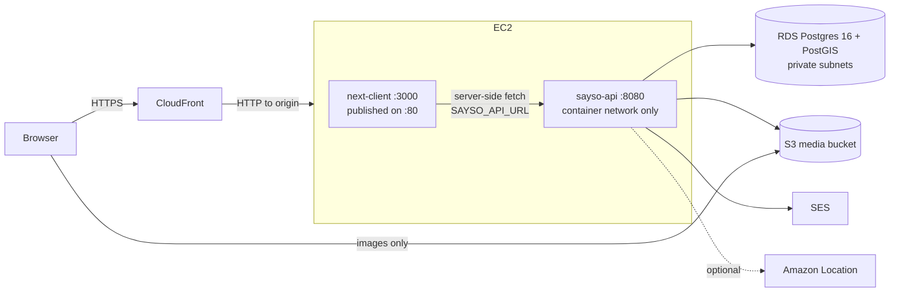

# Sayso Engineering Handbook

A complete working reference for the Sayso stack: the Go backend, the Next.js frontend, how to stand the whole thing up on a **brand-new AWS account**, and how to get data into it.

Everything about the code was read out of the working trees at `/repo/sayso/sayso/` on 2026-08-21. The AWS section is written as a greenfield runbook — it provisions the platform from an empty account rather than describing any particular existing deployment. Placeholders like `<ACCOUNT_ID>`, `<REGION>` and `sayso.example` are yours to substitute.

---

## Table of contents

1. [Orientation](#1-orientation)
2. [Architecture](#2-architecture)
3. [The Go backend](#3-the-go-backend)
4. [The command-line toolbox](#4-the-command-line-toolbox)
5. [The Next.js frontend](#5-the-nextjs-frontend)
6. [Local development](#6-local-development)
7. [Seeding](#7-seeding)
8. [Deploying to a new AWS account](#8-deploying-to-a-new-aws-account)
9. [Operations runbook](#9-operations-runbook)
10. [Extending the system](#10-extending-the-system)
11. [Known gaps](#11-known-gaps)

---

## 1. Orientation

Sayso is a South African local-business **reviews and discovery** product. A visitor browses businesses and events in Cape Town, writes reviews, earns XP and badges, saves things to lists, and messages owners. A business owner claims their listing, edits it, posts events, and reads enquiries. An admin approves submissions, works the claim and moderation queues, and defines which geographic areas the catalogue covers.

The current stack is the second generation. The first — `/repo/sayso/sayso-web`, Next.js on Supabase with all logic in the frontend, ~50 tables, 278 RPCs, 34 materialised views and 105 triggers — is **superseded**. It is kept for reference and UI matching only. The rebuild deliberately did not port that schema wholesale; it was rebuilt domain by domain, and the Supabase RPC logic became Go.

### Repository layout

```
/repo/sayso/
├── sayso/
│   ├── sayso-api/            ← Go backend. module github.com/Sayso-Reviews-Pty-Ltd/sayso-api
│   ├── next-client/          ← Next 16 frontend
│   ├── sayso-api.zip         ← 33 MB source snapshot (2026-07-31)
│   └── next-client.tar.gz    ← 2.6 GB snapshot incl. node_modules (2026-07-31)
├── sayso-web/                ← legacy Supabase app (reference only)
├── ref/
│   ├── brandfetch/           ← 8.6 MB harvested brand JSON + logos + generated load.sql
│   └── events/               ← harvested schema.org ld+json event snapshots
└── imgopt/                   ← image-optimisation working dir
```

Each repo carries its own `docs/superpowers/` with the design specs and phased plans the features were built from — 30 plans and 27 specs in `sayso-api` alone. When you need the *why* behind a domain, that is where it is written down.

> **Neither repo has a git remote.** `git remote -v` is empty in both. All history is local. Both `main` branches are current with the last deployed tree; a dozen merged feature branches remain as history. **Setting up a remote is the single highest-value thing you can do to de-risk this project.**

### The two deployables

| | `sayso-api` | `next-client` |
|---|---|---|
| Runtime | one static Go binary | Node 24 running Next's standalone server |
| Listens on | `:8080` | `:3000` |
| Public? | **never** — no CORS anywhere in the codebase | yes, behind the CDN |
| State | Postgres + PostGIS, S3 | none |
| Image size | ~28 MB (distroless) | ~413 MB (node:24-slim) |

---

## 2. Architecture



Three structural decisions drive everything else:

**1. The browser never talks to the API.** There is no CORS middleware in the Go codebase at all — deliberately. Every backend call originates on the Next server: an async Server Component, a Server Action, or a route handler acting as a BFF. The API is reachable only from the web container.

**2. Session tokens never reach client JavaScript.** The API issues a JWT access token plus an httpOnly `sayso_refresh` cookie. The Next BFF re-issues both as its own httpOnly `sa_access` / `sa_refresh` cookies on the frontend origin. Client components have no token to leak, and no `Authorization` header is ever built in the browser.

**3. The database is the schema of record and the server migrates itself.** `cmd/server` runs goose migrations on boot before it binds a port. Deploying a new image *is* running the migration. There is no separate migration step to forget.

---

## 3. The Go backend

Go **1.25.7**. The dependency list is short on purpose:

| Dependency | Used for |
|---|---|
| `jackc/pgx/v5` | Postgres driver + `pgxpool` |
| `pressly/goose/v3` | migrations, over an `embed.FS` |
| `golang-jwt/jwt/v5` | HS256 access tokens |
| `golang.org/x/crypto` | bcrypt (cost 12) |
| `golang.org/x/oauth2` | Google OAuth code exchange |
| `google/uuid` | ids |
| `aws-sdk-go-v2` | S3, SESv2, Location |
| `testcontainers-go` (+ postgres module) | integration tests against real PostGIS |

No web framework, no ORM, no DI container, no logging library. Routing is `net/http`'s `ServeMux` with Go 1.22+ method patterns. Logging is `log.Printf`.

### 3.1 The `*-api` package convention

Each business domain is a directory named `<domain>-api` whose Go package name drops the suffix — directory `business-api` declares `package business`. Inside each:

- the **root** holds domain types, sentinel errors, the `Repository` **interface** (always "Repository", never "Store"), and a `Service` where there is behaviour worth naming;
- a **`postgres/`** subpackage holds the concrete implementation over a shared `*pgxpool.Pool`.

The interface lives with the domain, not with the implementation — so the domain compiles and unit-tests without a database, and `httpapi` tests can substitute hand-written fakes.

### 3.2 The domain packages

| Package (dir) | Go pkg | Owns |
|---|---|---|
| `auth-api` | `auth` | register/login/logout, rotating refresh with reuse detection, email verification, Google OAuth exchange |
| `user-api` | `user` | users, profile, suspension, global roles (`RoleRepository`) |
| `business-api` | `business` | businesses, addresses (PostGIS), categories, memberships, claims, and all discovery/ranking SQL |
| `review-api` | `review` | reviews, helpful votes, flags, facet ratings, moderation, stats |
| `event-api` | `event` | events, event categories, RSVPs, event reviews, external-source provenance |
| `group-api` | `group` | the generic typed-membership substrate: franchises, favourites, likes, interests, lists |
| `trophy-api` | `trophy` | badge catalogue and pull-based awarding |
| `xp-api` | `xp` | XP ledger, level curve, perks, leaderboard |
| `challenge-api` | `challenge` | weekly challenges and per-ISO-week progress |
| `notify-api` | `notify` | notifications, in-process SSE `Hub`, allowlisted notification email |
| `message-api` | `message` | 1:1 conversations, threads, per-participant read state |
| `activity-api` | `activity` | one row per user per calendar day; feeds daily XP and streak badges |
| `property-api` | `property` | property definitions, source-attributed properties, annotations, images |
| `area-api` | `area` | serviceable-area admin (PostGIS polygons) |
| `search-api` | `search` | full-text search, suggestions, per-user search history |
| `lead-api` | `lead` | business enquiries from the public listing page |
| `contact-api` | `contact` | site contact form |

**Cross-cutting packages** carry no `-api` suffix and no repository:

`config` · `persistence` · `token` · `httpapi` · `email` · `storage` · `oauthprovider` · `geocode` · `areagate` · `ownership` · `jsonld` · `ingest` · `osm` · `quicket` · `ticketmaster` · `brandfetch` · `migrations` · `testsupport`

Dependency direction is enforced by convention and is worth preserving:

- `osm` imports `business`, never the reverse, and depends on a narrow `osm.SeedWriter` rather than the concrete repository.
- `trophy` and `challenge` read the `reviews` / `business_categories` **tables** with raw SQL and import no other domain's Go package. Awarding XP and sending notifications for a newly-earned badge happens in `httpapi`, not in `trophy`.
- `event` imports `business` to reuse `Address`, `AddressInput` and `Slugify` — the address and category substrate is shared, not duplicated.
- `notify` needs a user's email address but does not import `user`. It takes an injected `EmailLookup func(ctx, uuid) (string, error)` instead.

That last pattern — inject a narrow function rather than import a package — is used consistently and is the reason the dependency graph stays acyclic without a `internal/shared` dumping ground.

### 3.3 `persistence` and migrations

The entire persistence bootstrap is 40 lines and two functions:

```go
persistence.Connect(ctx, url) (*pgxpool.Pool, error)  // pgxpool.New + Ping
persistence.Migrate(url, fsys fs.FS) error            // database/sql + goose provider
```

`Migrate` opens a separate `database/sql` handle using the `pgx` stdlib driver (goose needs `*sql.DB`), applies everything, and closes it. `Connect` then opens the pool the application actually uses.

Migrations live in `migrations/*.sql` and are embedded:

```go
package migrations
//go:embed *.sql
var FS embed.FS
```

so the binary is self-contained — the deployed image needs no migration files on disk.

`./cmd/server -migrate-only` applies and exits, which is what you want in a one-shot task or a CI check.

> **The baseline's down-migration is deliberately not reversible.** It used to be `DROP SCHEMA public CASCADE; CREATE SCHEMA public;`. Since the server runs migrations automatically against `DATABASE_URL`, the tooling is already pointed at production — one `goose down` reaching that migration would have destroyed everything. It was replaced with a comment explaining why.

### 3.4 `config` — environment only, fails fast

`config.Load()` reads `os.Getenv` through an injectable getter (so `config_test.go` can drive it with a map) and returns a `Config` struct. Exactly two hard failures: `DATABASE_URL` must be present, and `JWT_SECRET` must be at least 32 bytes. Everything else has a default.

| Variable | Default | Notes |
|---|---|---|
| `LISTEN_ADDR` | `:8080` | |
| `DATABASE_URL` | — | **required** |
| `JWT_SECRET` | — | **required, ≥ 32 bytes** |
| `ACCESS_TTL` | `15m` | Go duration string |
| `REFRESH_TTL` | `720h` | 30 days |
| `GOOGLE_CLIENT_ID` / `_SECRET` / `_REDIRECT_URL` | — | the BFF owns the OAuth UX; the API only exchanges codes |
| `SMTP_HOST` / `SMTP_PORT` / `FROM_EMAIL` | `localhost` / `1025` / `no-reply@sayso.local` | Mailpit locally |
| `FRONTEND_URL` | `http://localhost:3000` | used in verification links **and** to derive cookie security |
| `COOKIE_DOMAIN` | `localhost` | |
| `COOKIE_SECURE` | *derived* | `true` when `FRONTEND_URL` starts `https://`; explicit value overrides; the server logs a loud warning whenever it resolves false |
| `MEDIA_DIR` / `MEDIA_BASE_URL` | `./media` / `http://localhost:8080/media` | local blob store |
| `S3_BUCKET` / `S3_REGION` / `S3_PUBLIC_BASE_URL` | unset | **setting `S3_BUCKET` switches storage to S3 and stops registering the local `/media/` handler** |
| `EMAIL_PROVIDER` / `SES_REGION` / `RESEND_API_KEY` | — | provider selection (§3.20) |
| `NOTIFY_EMAIL_ENABLED` / `NOTIFY_EMAIL_FROM` | `false` / `Sayso <no-reply@sayso.co.za>` | |
| `GEOCODE_ENABLED` / `NOMINATIM_URL` | `false` / OSM Nominatim | read directly in `main`, not through `config` |

The derived `COOKIE_SECURE` is worth understanding, because getting it wrong cost a full debugging session once. A `Secure` cookie is not stored by the browser over plain HTTP. Run the frontend on `http://` with `COOKIE_SECURE=true` and every login silently fails to persist — the symptom presented as "interests aren't saving" and "OAuth not configured", neither of which was the actual fault. Deriving it from `FRONTEND_URL` means production is correct by default; the boot warning makes the insecure case impossible to miss.

### 3.5 The composition root

`cmd/server/main.go` is one file and reads top-to-bottom as the wiring diagram of the entire system. In order:

1. **Config and migrate.** `config.Load()` → `persistence.Migrate()` → exit if `-migrate-only`.
2. **Pool.** `persistence.Connect()` produces one `*pgxpool.Pool` shared by every repository. There is no per-domain connection.
3. **Repositories and services.** `userpg.New(pool)`, `bizpg.New(pool)`, and so on. `business.Service` optionally gains `.WithGeocoder(geocode.NewNominatim(...))` when `GEOCODE_ENABLED=true`.
4. **Email provider.** `buildEmailer()` selects exactly one (§3.20). Auth falls back to `email.Noop` when nothing is configured, so registration never depends on email being wired.
5. **Middleware bundle.** `mw := &httpapi.Mw{Tokens, Users, Roles}` — one instance passed to every route registration.
6. **Group kinds resolved up front.** The `franchise` and `list` kinds are looked up from the database at boot and their ids injected into handlers. A missing kind is `log.Fatalf` — they are seeded by migration 0001, so absence means the database is wrong and the process should not start.
7. **Notifications.** `notify.NewHub()`, then `notifySvc.WithHub(hub).WithEmail(mailer, enabled, lookup)`. The email lookup closure resolves a user's address via `users.GetByID`, keeping `notify` free of a `user` import.
8. **Media storage.** `S3_BUCKET` set → `storage.NewS3` over an `aws-sdk-go-v2` client. Otherwise `storage.NewLocal` **and** a `GET /media/` file server. With S3 the local handler is not registered at all — the bucket or CDN serves those bytes.
9. **Routing.** `httpapi.NewRouter(h)` returns a mux with the auth routes; then roughly twenty `httpapi.Register*Routes(mux, handlers, mw)` calls add the rest.
10. **Health.** `GET /healthz` — 200 when `pool.Ping` answers inside 2 seconds, 503 otherwise. Unauthenticated and cheap.
11. **Server and shutdown.**

```go
srv := &http.Server{
    Addr:              cfg.ListenAddr,
    Handler:           mux,
    ReadHeaderTimeout: 10 * time.Second,
    ReadTimeout:       60 * time.Second,   // bounds a whole 5 MB upload on a slow mobile link
    WriteTimeout:      30 * time.Second,
    IdleTimeout:       120 * time.Second,
}
```

Graceful shutdown on SIGINT/SIGTERM with a 15-second drain, so in-flight requests finish before the container exits.

> **`WriteTimeout` and SSE.** Go sets one write deadline for an entire response and does not extend it on subsequent writes. A long-lived Server-Sent Events stream is therefore severed at 30 seconds no matter how often you send keep-alives. `notification_stream.go` clears the deadline explicitly via `http.NewResponseController(w).SetWriteDeadline(time.Time{})`. **Any future long-lived response must do the same.**

### 3.6 Authentication in depth

**Token shapes.** Access tokens are HS256 JWTs carrying `sub`, `jti`, `iat`, `exp` plus `email`, `email_verified` and `is_admin`. Refresh tokens are opaque: 32 bytes from `crypto/rand`, base64url-encoded for the client, and stored **only as a SHA-256 hex hash**. The raw value never touches the database.

**Registration.** bcrypt at cost 12, then create the user, then send a verification email, then issue tokens. The email send is **best-effort by design**:

```go
// The verification token is already persisted, so a failed send (e.g. no email
// provider configured in this environment) must not fail registration.
if err := s.d.Emailer.Send(ctx, u.Email, "Verify your Sayso email", body); err != nil {
    log.Printf("auth: send verification email to %s failed (best-effort): %v", u.Email, err)
}
```

That is not defensive coding for its own sake — registration was returning 502 in production because no SMTP host was reachable.

**Login.** On an unknown email the service still runs a real bcrypt comparison against a fixed dummy hash before returning a generic error, so response timing does not disclose which addresses are registered.

**Refresh rotation with reuse detection.** Every refresh mints a *new* refresh token and revokes the old one, recording `replaced_by`. If a token that is already revoked is presented — meaning it was captured and replayed — the service revokes **the entire chain for that user**:

```go
if rt.RevokedAt != nil {
    // Reuse of a revoked token: nuke the whole chain for safety.
    _ = s.d.Refresh.RevokeAllForUser(ctx, rt.UserID)
    return TokenPair{}, ErrTokenReused
}
```

**`issueTokens` is the single funnel** for register, login, refresh and OAuth. It checks suspension, looks up the global ADMIN role, mints the access token, generates and persists the refresh token. One place to audit.

**Email verification** reuses the same generate/hash primitives (`token.GenerateRefreshToken` / `HashRefreshToken`) for its 24-hour single-use tokens. `ResendVerification` returns `nil` for an unknown address — it will not disclose whether an email is registered.

**Google OAuth** is split deliberately. The *frontend* owns the user-facing flow (authorization URL, PKCE, state cookie, callback); the *API* exposes only `POST /auth/oauth/google/exchange`, which takes `{code, verifier, redirect_uri}`, exchanges it with Google, upserts an `oauth_identities` row, finds or creates the user, and returns a token pair as JSON. Redirect-based OAuth handlers were removed from the API when the BFF took over.

### 3.7 Authorization

Three levels, applied at route registration:

| Wrapper | Enforces |
|---|---|
| *(none)* | public |
| `mw.RequireAuth` | valid Bearer access token, **plus a per-request database suspension check** |
| `mw.RequireAdmin` | `RequireAuth`, then the global `ADMIN` role from `user_roles` |

The suspension check runs on every authenticated request rather than trusting the token:

```go
suspended, checkErr := m.Users.IsSuspended(r.Context(), uid)
if suspended { writeError(w, http.StatusForbidden, "account suspended"); return }
```

That costs one indexed lookup per request and buys instant lockout — without it a suspended user keeps full access until their 15-minute access token expires.

**Admin is a row in `user_roles`, not a column on `users`.** There is no `users.is_admin` to poke. Grant it with `make grant-admin EMAIL=…`. The JWT's `is_admin` claim is informational for the UI; the middleware always re-checks the database.

Per-business roles (`OWNER`, `MANAGER`, `EDITOR`) live in `user_businesses` and are checked inside handlers via `MembershipRole`, not by middleware — the resource id is only known once the handler has parsed it.

### 3.8 Endpoint catalogue

<details>
<summary><b>Auth &amp; user</b></summary>

| Method | Path | Access |
|---|---|---|
| POST | `/auth/register` | public |
| POST | `/auth/login` | public |
| POST | `/auth/refresh` | public (cookie) |
| POST | `/auth/logout` | public (idempotent) |
| GET | `/auth/user` | auth |
| PATCH | `/user` | auth |
| POST | `/auth/verify-email` | public |
| POST | `/auth/resend-verification` | public |
| POST | `/auth/oauth/google/exchange` | public |
| POST | `/user/onboarding` | auth |
</details>

<details>
<summary><b>Businesses, categories, feeds, search</b></summary>

| Method | Path | Access |
|---|---|---|
| GET | `/categories` | public |
| GET | `/businesses` | public (filters: `category`, `city`, `suburb`, `sort`, `limit`, `offset`, `lat`+`lng`+`radius`) |
| GET | `/businesses/{idOrSlug}` | public (own pending visible to creator/owner/admin) |
| GET | `/businesses/{idOrSlug}/other-locations` | public (same franchise group) |
| GET | `/businesses/{idOrSlug}/images` | public |
| GET | `/businesses/{businessId}/insights` | public (facet averages) |
| POST | `/businesses` | auth → `pending_approval` |
| GET | `/user/businesses` · PATCH `/user/businesses/{id}` | auth |
| POST | `/businesses/{id}/claim` | auth |
| GET | `/trending` | public |
| GET | `/user/for-you` · `/user/for-you/rails` · `/user/saved` | auth |
| GET | `/search/suggestions` · `/search/businesses` | public |
| POST/GET/DELETE | `/user/search-history` | auth |
</details>

<details>
<summary><b>Reviews &amp; engagement</b></summary>

| Method | Path | Access |
|---|---|---|
| GET / POST | `/businesses/{businessId}/reviews` | public / auth |
| PUT / DELETE | `/reviews/{id}` | auth (author only) |
| POST | `/reviews/{id}/images` | auth, owner-gated and size-capped **before** any blob write |
| POST | `/reviews/{id}/vote` | auth (own review → 403) |
| POST | `/reviews/{id}/flag` · `/flags` | auth |
| GET | `/user/reviews` · `/reviewers/{id}` · `/reviewers/{id}/reviews` | auth / public |
| POST | `/user/activity/ping` | auth |
</details>

<details>
<summary><b>Events</b></summary>

| Method | Path | Access |
|---|---|---|
| GET | `/event-categories` · `/events` · `/events/{idOrSlug}` · `/events/{id}/reviews` · `/businesses/{idOrSlug}/events` | public |
| POST | `/events/{id}/reviews` | auth |
| PUT / DELETE | `/events/{id}/rsvp` | auth |
| POST / PATCH / POST | `/user/events` · `/user/events/{id}` · `/user/events/{id}/cancel` | auth (owner) |
| GET | `/user/events/rsvps` | auth |
</details>

<details>
<summary><b>Gamification, social, misc</b></summary>

| Method | Path | Access |
|---|---|---|
| GET | `/badges` · `/users/{id}/badges` | public |
| GET / POST | `/user/badges` · `/user/badges/evaluate` | auth |
| GET | `/challenges` | public; per-week progress added when a Bearer token is present |
| GET | `/user/xp` | auth |
| GET | `/leaderboard` | public (`?tab=businesses` for top-rated) |
| GET | `/user/notifications` · `/user/notifications/stream` (SSE) · `/user/notifications/unread-count` | auth |
| POST | `/user/notifications/{id}/read` · `/user/notifications/read-all` | auth |
| POST/GET | `/user/conversations` · `/user/conversations/{id}/messages` · `…/unread-count` | auth |
| GET/POST/PATCH/DELETE | `/user/lists` · `/user/lists/{id}` · `/user/lists/{id}/members/{businessId}` · `/user/business-lists/{businessId}` | auth |
| GET/PUT/DELETE | `/user/groups/{type}/{name}[/{id}]` | auth |
| POST | `/businesses/{businessId}/leads` · `/contact` | public |
| GET | `/healthz` | public |
</details>

<details>
<summary><b>Admin — every route wrapped in <code>RequireAdmin</code></b></summary>

`GET /admin/stats` · `GET /admin/users` · `POST /admin/users/{id}/suspend|reactivate` · `GET /admin/businesses` · `GET /admin/businesses/pending` · `POST /admin/businesses/{id}/approve|reject|suspend|reactivate` · `GET /admin/business-claims` · `POST /admin/business-claims/{id}/pickup|approve|reject` · `GET /admin/reviews/flagged` · `POST /admin/reviews/{id}/pickup|moderate` · `GET/POST /admin/groups` · `GET/POST /admin/groups/{id}/members` · `DELETE /admin/groups/{id}/members/{businessId}` · `GET/PUT/DELETE /admin/property-definitions[/{key}]` · `GET /admin/property-definitions/unmapped` · `GET /admin/areas` · `POST /admin/areas/{id}`
</details>

### 3.9 The data model

Twelve migrations, applied in order at boot. Every table carries `id`, `created_at` and `updated_at`, the last maintained by a shared `set_updated_at()` trigger.

| # | File | Introduces |
|---|---|---|
| **0001** | `baseline.sql` (764 lines) | 34 tables plus seed data — see below |
| 0002 | `search.sql` | `businesses.search_vector` (tsvector) + index |
| 0003 | `properties.sql` | `properties`, `property_definitions` |
| 0004 | `searchable.sql` | `property_definitions.searchable` |
| **0005** | `data_foundation.sql` | the normalised source-attributed substrate: `source`, `property`, `business_property`, `annotation`, `business_annotation`; transforms the old `properties` table |
| 0006 | `images.sql` | `image`, `business_image` with a partial unique index enforcing ≤1 displayed image per business |
| 0007 | `event_dedup.sql` | `event_dedup_key()` function + generated stored `events.dedup_key` |
| 0008 | `business_leads.sql` | `business_leads` |
| 0009 | `review_facets.sql` | `review_facets`, PK `(review_id, facet)`, rating 1–5 |
| 0010 | `contact_messages.sql` | `contact_messages` |
| 0011 | `service_areas.sql` | `service_areas` + three seeded polygons |
| 0012 | `badge_icons.sql` | points ~26 named badges at specific WebP icons |

**Baseline tables**, grouped:

- *Identity* — `users`, `oauth_identities`, `refresh_tokens`, `email_verification_tokens`, `roles`, `user_roles`
- *Catalogue* — `addresses` (PostGIS `geography(Point,4326)`, GIST-indexed), `categories` (self-referencing tree), `businesses`, `business_osm`, `business_categories`, `user_businesses`
- *Events* — `events`, `event_categories`, `event_businesses`, `event_rsvp`
- *Reviews* — `reviews`, `review_vote`, `flag`, `review_image`
- *Gamification* — `badge`, `user_badge`, `xp_event`, `user_xp`, `challenge`, `user_challenge_progress`, `user_activity`
- *Grouping* — `group_kind`, `groups`, `group_member`
- *Workflow & social* — `business_claim`, `notification`, `conversation`, `conversation_participant`, `message`, `search_history`

**Baseline seed data** — the things everything else depends on:

- The SYSTEM user `00000000-0000-0000-0000-000000000001` / `system@sayso.internal`, no password, which owns seeded listings and unassigned admin-queue items.
- Roles `ADMIN`, `OWNER`, `MANAGER`, `EDITOR`.
- The category tree: 6 top-level business groups (`food-and-drink`, `beauty-and-wellness`, `health`, …) over 20 business leaves (`restaurants`, `cafes`, `bars`, `takeaways`, `hotels`, `guesthouses`, `salons`, `spas`, `gyms`, `supermarkets`, `retail`, `clothing`, `electronics`, `hardware`, `pharmacies`, `doctors`, `dentists`, `mechanics`, `plumbers`, `electricians`), plus a separate `events` parent with its own leaves (`music`, `arts-culture`, `sports-fitness`, …).
- Group kinds: `(business, franchise)`, `(business, favorites)`, `(business, likes)`, `(business, list)`, `(category, likes)`, `(category, favorites)`, `(event, favorites)`, `(event, likes)`.
- ~60 badges across four groups (milestone, explorer, community, specialist), including generated per-category and per-group specialist badges.
- Three weekly challenges.

#### Design rules that are already settled

**No polymorphic supertype.** A `subject(id, kind, status)` spine was built, then removed entirely in favour of concrete typed FKs. The abstraction was found forced — especially categories-as-subject — and was lightly used. The refactor was net −63 lines across 26 files. The only remaining loose-polymorphic references are `group_member.member_id` (discriminated by the kind's `member_type`) and `flag.target_id` (discriminated by `target_type`). Both are documented as such.

**Reviews target exactly one thing.** `reviews` has both `business_id` and `event_id`, nullable, with a database check constraint (`reviews_target_chk`) enforcing the exclusive-or. Event reviews never feed the business-review badge aggregates, because the trophy queries scope to `business_id`.

**Provenance goes in a join table.** OSM identity lives in `business_osm(business_id, osm_type, osm_id)`, not as columns on `businesses`.

**Source attribution is first-class.** `property.source_id → source`, seeded with `osm`, `owner`, `brandfetch`, `geocode`, `bedrock`. Any fact rendered on a business page can be traced to who asserted it, and a source's contributions can be cleared and re-loaded as a set.

**Seeded ids are not portable — slugs are.** Business ids are `gen_random_uuid()`. Only the slug is deterministic:

```go
// SeedSlug builds a stable, unique slug: slugified name + base-36 OSM id.
func SeedSlug(name string, osmID int64) string {
    return Slugify(name) + "-" + strconv.FormatInt(osmID, 36)
}
```

Any SQL generated against one database and applied to another must resolve by slug. This bit once: a generated brand-logo loader used hard-coded id literals resolved against the local Docker database, and would have silently attached nothing in production. It was reworked to emit `INSERT … SELECT id FROM businesses WHERE slug IN (…)`, which is both portable and skip-safe.

**Every table gets `id + created_at + updated_at`.** Non-negotiable; the trigger is already there.

### 3.10 `areagate` — the serviceable-area rule

The catalogue can be limited to defined geographic polygons. The rule is generated by a single function so it cannot drift between the six queries that need it:

```go
// param-free, so it can be appended to any WHERE without disturbing $-numbering
areagate.For("b.address_id")
```

A row is in scope when **any** of:

1. no `service_area` is `active` — the feature is off, everything shows;
2. it has **no located address** — no address row, or coordinates not yet geocoded;
3. its coordinates fall inside at least one active area (`ST_Within`).

Clause 2 is the one that matters and the one that was originally missing. Coordinates are populated by an optional geocoding pass, so an admin-approved owner submission may legitimately have none. Requiring coordinates made every such listing invisible on every public list, search, feed and detail page — while still reading as "active" to its owner. A silent disappearance with no diagnostic. Absent location now means *unknown*, not *outside*: the gate narrows the catalogue only for rows it can actually place.

It is a **live** filter, not a precomputed flag. Toggling an area at `/admin/areas` changes results on the next query. Out-of-area detail pages 404 for the public; owners and admins bypass the gate via `GetForViewer`.

Migration 0011 seeds three active polygons — CBD / City Bowl, Atlantic Seaboard, Southern Suburbs — which were validated against known suburbs before shipping. **Applying 0011 to a populated database immediately scopes the catalogue.** On a fresh deployment with data outside those polygons, either widen them or set them inactive.

### 3.11 Discovery and ranking

All of it is SQL in `business-api/postgres/repository.go`, deliberately kept **off** the `business.Repository` interface and off `business.Service` — `FeedHandlers` holds the concrete `*bizpg.Repository` directly, because these are query-shaped, not domain-shaped, and putting them on the interface would force every test fake to grow stubs for them.

**`enrichedSelect`** is the shared projection every card-shaped query builds on. One statement gives you the business, its primary category, its suburb/city and coordinates, its visible-review count and average, and its per-facet averages:

```sql
SELECT b.id, b.slug, b.name, b.description, b.price_range, b.image_url,
       b.status, b.created_at, b.updated_at,
       a.suburb, a.city, ST_X(a.coordinates::geometry), ST_Y(a.coordinates::geometry),
       c.id, c.slug, c.label,
       COALESCE(rs.c, 0), COALESCE(rs.avg, 0), fs.facets
FROM businesses b
LEFT JOIN addresses a           ON a.id = b.address_id
LEFT JOIN business_categories bc ON bc.business_id = b.id AND bc.is_primary
LEFT JOIN categories c           ON c.id = bc.category_id
LEFT JOIN (SELECT business_id, count(*) c, COALESCE(ROUND(AVG(rating)::numeric,2),0) avg
             FROM reviews WHERE status='visible' GROUP BY business_id) rs ON rs.business_id = b.id
LEFT JOIN (SELECT business_id, json_object_agg(facet, avg) facets FROM (
             SELECT r.business_id, rf.facet, ROUND(AVG(rf.rating)::numeric,1) avg
               FROM review_facets rf JOIN reviews r ON r.id = rf.review_id
              WHERE r.status='visible' GROUP BY r.business_id, rf.facet
           ) g GROUP BY business_id) fs ON fs.business_id = b.id
```

Ratings are computed live from visible reviews rather than read from a cache, so hiding a review is immediately reflected everywhere. (`business_stats` exists and is recomputed in-transaction on write, but the card queries do not depend on it.)

**`List`** applies `filterConds` — category slug, city ILIKE, suburb ILIKE, plus the area gate — with `$`-placeholders numbered from the current arg count so callers can bind leading arguments first.

**`ListNear`** is selected automatically by `Service.List` when both `Lat` and `Lng` are present. It sorts by PostGIS distance ascending within `RadiusM` (default 20 km) and populates `DistanceM` on each result.

**`Trending`** ranks by 30-day engagement:

```sql
LEFT JOIN (
  SELECT gm.member_id,
         count(*) FILTER (WHERE gm.created_at >= now() - interval '30 days') AS recent_c,
         count(*) AS all_c
  FROM group_member gm
  JOIN groups g     ON g.id = gm.group_id
  JOIN group_kind k ON k.id = g.kind_id
  WHERE k.member_type='business' AND k.name IN ('favorites','likes')
  GROUP BY gm.member_id
) lk ON lk.member_id = b.id
...
ORDER BY COALESCE(lk.recent_c,0) DESC, COALESCE(lk.all_c,0) DESC,
         COALESCE(rs.c,0) DESC, md5(b.id::text || $1)
```

Three things to notice. The tiebreaker is `md5(id || seed)` — a **deterministic shuffle**, where the seed is the current day number, so the ordering is stable within a day and reshuffles at midnight without any scheduled job. The query over-fetches, then applies a **per-primary-category diversity cap of 3** in Go, so trending is never nine restaurants. And engagement is read through the generic `group_member` substrate rather than a bespoke likes table.

**`ForYou`** builds a `cat_weight` CTE from two signals — the user's direct category likes, and the categories of businesses they have favourited or liked — sums the weights, ranks by weight, excludes anything already engaged with, and then **round-robins across categories** in Go so the result interleaves rather than front-loading the strongest category. It returns `nil, nil` (not an error) when the user has no affinity yet.

**`Recommend`** is the same shape parameterised by a single signal (`SignalLikes` or `SignalFavorites`), so two independently-derived rails can be built from different evidence.

**`ExploreByInterests`** shuffles the interest-matching catalogue by the daily seed, and **falls back to the whole active catalogue when the user has no interests** — so Explore works for everyone, including a brand-new account.

**`ForYouRails`** is the composite endpoint. It fires five queries **concurrently** with a `sync.WaitGroup` (likes-rail, favourites-rail, explore-rail, trending-rail, and the user's top interest category for the client-side geo rail), then composes:

```go
rails := composeRails([]railResult{
    {Key: "likes",     Title: "Things we think you'd like", Items: ...},
    {Key: "favorites", Title: "Don't miss out on these",     Items: ...},
    {Key: "explore",   Title: "Explore Cape Town",           Items: ...},
    {Key: "trending",  Title: "Trending now",                Items: ...},
}, 4)
```

`composeRails` dedupes across rails **in order** — a business appears only in its first, strongest rail — and drops any rail left with fewer than 4 items. A dropped rail does not consume ids from later rails, so dropping never cascades.

### 3.12 Search

Three matching strategies unioned in one statement, ranked together:

```sql
WITH prop_matches AS (
  SELECT DISTINCT bp.business_id
  FROM property p
  JOIN business_property bp     ON bp.property_id = p.id
  JOIN property_definitions d   ON d.key = p.key AND d.searchable
  WHERE immutable_unaccent(p.value) ILIKE '%' || immutable_unaccent($1) || '%'
)
SELECT b.id
FROM businesses b, websearch_to_tsquery('english', immutable_unaccent($1)) AS tsq
WHERE <filters + area gate>
  AND ( b.search_vector @@ tsq
     OR immutable_unaccent(b.name) ILIKE '%' || immutable_unaccent($1) || '%'
     OR EXISTS (SELECT 1 FROM business_categories bc JOIN categories c ON c.id=bc.category_id
                 WHERE bc.business_id=b.id
                   AND (immutable_unaccent(c.label) ILIKE ... OR c.slug ILIKE ...))
     OR b.id IN (SELECT business_id FROM prop_matches) )
ORDER BY ts_rank(b.search_vector, tsq) DESC,
         similarity(immutable_unaccent(b.name), immutable_unaccent($1)) DESC,
         b.created_at DESC
```

So a query matches on full text (name + description), on a name substring, on a category label or slug, or on any **searchable property value** — that last one is why `property_definitions.searchable` exists (migration 0004): an admin decides which property keys participate in search.

This needs three Postgres extensions: `pg_trgm` (for `similarity` and the GIN trigram index on property values), `unaccent` (wrapped in an `immutable_unaccent` function so it can be used in indexes), and `postgis`. Provision all three (§8.4).

**Suggestions** are a name-prefix query, and they carry the area gate for a specific reason spelled out in the code: without it the dropdown offered branches whose detail page then 404'd. Each suggestion carries a suburb, because several branches of the same chain share a name.

### 3.13 Reviews, facets, votes and flags

One review per author per business, enforced by a unique constraint; a duplicate surfaces as `ErrAlreadyReviewed` → 409. Status is `visible | hidden | removed`.

**Facets** are a fixed product taxonomy — `punctuality`, `value`, `friendliness`, `trustworthiness` — optional per review, 1–5 each. `NormalizeFacets` drops unknown keys and out-of-range values before persisting. They aggregate into the "Performance Insights" panel and into the mini-stats on list cards.

**Helpful votes** live in `review_vote`; voting on your own review is 403 (`ErrOwnReview`). The count is computed, not stored.

**Flags** are the one genuinely polymorphic thing besides group members. `flag.target_type` is `review | event | business` with no FK, and the lifecycle is `pending → in_review → reviewed | dismissed`. At `FlagThreshold = 5` pending flags a review is auto-hidden by setting `reviews.status`. Valid reasons are a closed set: `spam`, `inappropriate`, `harassment`, `off_topic`, `other`.

**Non-authors get 404, not 403.** `CheckAuthor` returns `ErrNotFound` for both a missing review and someone else's review, so the API does not disclose that a given review id exists.

### 3.14 The admin-queue ownership rule

`package ownership` is pure logic — no SQL — shared by the claim queue and the moderation queue:

```go
var SystemUserID = uuid.MustParse("00000000-0000-0000-0000-000000000001")

func CheckPickUp(status string, owner, admin uuid.UUID) error  // pending + (SYSTEM or self)
func CheckDecide(status string, owner, admin uuid.UUID) error  // in_review + owned by caller
```

An item is owned by SYSTEM until an admin **picks it up**, which moves it to `in_review` and assigns it. Only the assignee may decide it. Two admins cannot double-decide the same claim, and the pickup itself is atomic in SQL (`ErrClaimNotPending` when someone beat you to it).

Claim approval is transactional: `ApproveClaim` grants the `user_businesses` OWNER row **and** marks the claim approved in one transaction, so ownership can never be granted without the decision being recorded.

**`OwnerIDs`, not `created_by`.** For notifications and enquiries, the owner is the set of `user_businesses` OWNER members, falling back to `created_by` only when there is no membership — and excluding SYSTEM. Seeded listings are created by SYSTEM and claiming one only *adds* a membership row; `created_by` is never rewritten. Using `created_by` meant claimed listings were notifying `system@sayso.internal`.

### 3.15 Events and the ingest backbone

Events mirror businesses: `Repository` interface plus a `postgres/` implementation, reusing `business.Address`, `business.AddressInput` and `business.Slugify` through type aliases.

Types are `event | special`; status is `draft | published | cancelled` with public reads showing `published` only. External provenance is recorded as `quicket | jsonld | ticketmaster` plus an external id.

**Cross-source dedup** is a generated column:

```sql
CREATE FUNCTION event_dedup_key(p_title text, p_starts_at timestamptz, p_venue text)
  RETURNS text LANGUAGE sql IMMUTABLE PARALLEL SAFE AS
$$ SELECT lower(immutable_unaccent(coalesce(p_title,''))) || '|' ||
          ((p_starts_at AT TIME ZONE 'UTC')::date)::text || '|' ||
          lower(immutable_unaccent(coalesce(p_venue,''))) $$;

ALTER TABLE events ADD COLUMN dedup_key text
  GENERATED ALWAYS AS (event_dedup_key(title, starts_at, venue_name)) STORED;
```

Note the comment in the migration: the function is `PARALLEL SAFE` but deliberately **not** `STRICT`, because `venue_name` is nullable and coalesced — `STRICT` would short-circuit the whole call to NULL. The date bucket is pinned to UTC, so same-evening events straddling UTC midnight may bucket apart; that is an accepted limitation of the heuristic.

`package ingest` is the shared orchestrator every source funnels through:

```go
func Load(ctx, events []event.SeedEvent, w Writer) (Summary, error)
```

For each event: `FindDuplicate` → skip, else `UpsertSeeded`. Per-event errors are counted into `Summary.Failed` and never abort the batch. Adding a fourth source means writing a mapper to `[]event.SeedEvent` and calling `Load` — nothing else.

Owner-created events are transactional: `HostBusinessID` and `PrimaryCategoryID` are linked **in the same transaction** as the `events` row, because linking them afterwards leaves a half-built event visible if the process dies between calls.

### 3.16 Gamification

**XP** (`xp-api/xp.go`):

| Source | Points | Idempotency key |
|---|---|---|
| `review` | 20 | review id |
| `first_review` | 100 | **the author's own id** — so it lands exactly once, ever |
| `photo` | 5 | image id |
| `badge` | 30 | badge id |
| `helpful_vote` | 2 | awarded to the review's author, first time a given voter helps |
| `daily_active` | 5 | the date |
| `challenge` | per-challenge | challenge + period |

Awards are idempotent on `(user_id, source, ref_id)`, which is exactly what makes `backfill-xp` safe to re-run against a live database.

Level curve: `XPForLevel(n) = floor(100 · n^1.5)` — level 2 at 100 XP, level 3 at ~283, level 10 at ~3162. Perks unlock at levels 5 (Streak shield), 10 (Gold profile border), 15 (Monthly leaderboard access), 20 (Early badge eligibility), 30 (Featured reviewer) and 50 (Legend frame).

**Badges** are pull-based. `POST /user/badges/evaluate` computes the caller's `Aggregates` once, then awards every unearned badge whose threshold has been crossed, with `ON CONFLICT (user_id, badge_id) DO NOTHING` inside a transaction. Ten rule types:

`review_count` · `category_review_count` · `distinct_category_count` · `helpful_votes_received` · `group_review_count` · `distinct_group_count` · `first_review_count` (businesses where the user is the earliest visible reviewer) · `max_suburb_review_count` · `longest_streak` (consecutive SAST calendar days with ≥1 visible review) · `photo_count`

Progress toward unearned badges is computed on read, never stored.

**Challenges** are weekly, on ISO weeks starting Monday, with three seeded entries (3 reviews / 2 photos / 2 distinct categories). `challenge` imports no other domain; the handler awards XP and sends the notification for each newly-completed challenge — the same separation the badge code uses.

**Activity** is one row per user per calendar day, unique on `(user_id, activity_date)`. `Record` returns `firstToday bool` so the caller awards the once-per-day XP bonus exactly once, and the same table feeds the streak badges.

### 3.17 Notifications and SSE

Eight notification types: `badge_earned`, `review_received`, `business_approved`, `business_rejected`, `claim_approved`, `claim_rejected`, `message_received`, `challenge_complete`. Each carries a relative client path in `Link`, which the UI routes to directly.

`Service.Notify` persists the row, then best-effort publishes a realtime event carrying the user's recomputed unread count. A failure to recompute skips the push and never fails `Notify`. Producers call it after their action has already succeeded.

**Email delivery is allowlisted.** Only `business_approved`, `message_received`, `challenge_complete`, `claim_approved` and `claim_rejected` are ever emailed; everything else stays in-app. Sends are fire-and-forget on a `context.WithoutCancel(ctx)` so the request is never delayed by SMTP latency, and errors are logged, never propagated.

**The `Hub`** is an in-process pub/sub keyed by user: `map[uuid.UUID]map[int]chan Event`, 8-slot buffered channels, non-blocking sends that **drop rather than block** when a slow subscriber's buffer fills. `Subscribe` returns the channel plus an idempotent cancel closure. No Redis, no external broker — events live only for the process lifetime, which is the right trade for a badge counter.

**The SSE handler** sets the event-stream headers, clears the write deadline (§3.5), emits one immediate event with the current unread count so a fresh client is in sync, then loops on `select` over the subscription channel, a 25-second keep-alive ticker, and `r.Context().Done()`.

This design has one consequence worth stating plainly: **it does not survive horizontal scaling.** Two API replicas each have their own Hub, so a notification produced on replica A never reaches a stream held open on replica B. The client polls as a fallback so nothing breaks, but if you scale out, the Hub needs a shared backplane.

### 3.18 Messaging, leads and contact

**Messages** are 1:1 conversations between exactly two participants, optionally scoped to a business. Per-participant read state drives the unread count. Sentinel errors cover the real cases: `ErrNotParticipant`, `ErrEmptyBody`, `ErrSelfConversation`, `ErrNotFound`.

**Leads** (`POST /businesses/{id}/leads`) are unauthenticated: a prospective customer enquires from the public listing page without an account. **Contact** (`POST /contact`) is the site-wide form. Both are deliberately write-only from the public side.

### 3.19 Media storage and upload hardening

```go
type Storage interface {
    Save(ctx context.Context, key, contentType string, r io.Reader) (url string, err error)
    Delete(ctx context.Context, key string) error
}
```

Two implementations — `Local` (filesystem + a static file server) and `S3` (`manager.Uploader`, which handles multipart for large or streamed bodies). Callers are agnostic; `main` picks one from `S3_BUCKET`.

The review-photo upload handler is worth reading as a template, because the **ordering is the security property**:

1. **Ownership first.** `CheckAuthor` before anything else — a caller must not be able to push objects into the bucket using someone else's review id.
2. **Cap the body before parsing.** `http.MaxBytesReader(w, r.Body, maxUploadBytes)` *then* `ParseMultipartForm`. Parsing first was the bug: `ParseMultipartForm` spools anything over its in-memory limit to temp files, so an unauthenticated-size request could fill the disk. `maxMemory` is set equal to the cap so nothing spools at all.
3. **Size guard** on the declared part size → 413.
4. **Content type by sniffing** the first 512 bytes (`http.DetectContentType`), falling back to the declared header. Only JPEG, PNG and WebP are allowed.
5. **Re-cap during the copy**, in case `Size` was understated.
6. Key is `reviews/{reviewID}/{uuid}.{ext}` — path-scoped, unguessable, extension derived from the sniffed type.

### 3.20 Email providers

One provider, selected by environment, in priority order:

```
EMAIL_PROVIDER=ses or SES_REGION set  →  SES        (aws-sdk-go-v2 sesv2, instance role — no keys)
RESEND_API_KEY set                    →  Resend     (HTTPS API)
SMTP_HOST set and != "localhost"      →  SMTP       (net/smtp)
otherwise                             →  nil        (auth falls back to email.Noop)
```

The chosen provider is logged at boot (`email: provider = SES (af-south-1)`), which makes "why did no email arrive" a one-line log check.

`email.Emailer` is a single-method interface (`Send(ctx, to, subject, htmlBody) error`); `email.Recording` is the test double that captures sends.

### 3.21 Geocoding

Two independent directions, easily confused:

**Forward** — free-text address → coordinates. Used inside the running server on business submit and edit, gated by `GEOCODE_ENABLED`, implemented against OSM Nominatim. It is best-effort by construction: `maybeGeocode` never returns an error, caller-supplied coordinates always win, and it skips the request entirely unless there is some street or locality signal to work with. `geocodeQuery` joins the populated fields and appends "South Africa" when no country is given.

**Reverse** — coordinates → suburb/city/province/postcode. Used by the `geocode-backfill` tool against **Amazon Location Service**, paced at one call per `-rate` (default 100 ms), with a `-dry-run` mode.

Note the split: `geocode-backfill` takes its own `-region` flag (default `eu-west-1`), separate from the application's region. The place index does not have to live in the app's region — put it wherever Location Service is offered and you are comfortable sending coordinates.

> **Nominatim will reject you without a User-Agent** — its usage policy requires one and `NewNominatim` takes it as a required argument. The same is true of Overpass, which returns 406.

### 3.22 The property / annotation / image substrate

Migration 0005 introduced the generic data foundation that the business detail page's "About" and "Good to know" sections render from.

- `source(name, href)` — who asserted a fact.
- `property(key, value, source_id)` + `business_property(business_id, property_id, visible)` — M:N, so one property row (`cuisine=italian`, source osm) can attach to many businesses.
- `annotation(type, content, source_id)` + `business_annotation` — same shape for longer-form content like a brand description.
- `image(url, type, source_id)` + `business_image(business_id, image_id, displayed)` — with a **partial unique index** guaranteeing at most one `displayed` image per business.
- `property_definitions(key, label, format, searchable)` — governs display: `text`, `chips` (split on `;` or `,`), or `boolean`; and whether the key participates in search.

`GET /admin/property-definitions/unmapped` lists property keys present in data but with no definition — the admin's work queue for making raw OSM tags presentable.

### 3.23 HTTP conventions

Two helpers in `httpapi/middleware.go` cover every response:

```go
func writeJSON(w http.ResponseWriter, status int, body any)
func writeError(w http.ResponseWriter, status int, msg string)   // {"error": "..."}
```

Errors are always `{"error": "message"}` — the frontend's BFF layer relies on that shape. Request and response bodies are `snake_case`; the frontend maps to camelCase at its own boundary.

Domain sentinel errors map to status codes in the handler, never in the service: `ErrNotFound` → 404, `ErrForbidden`/`ErrOwnReview` → 403, `ErrAlreadyReviewed`/`ErrClaimExists` → 409, `ErrInvalidInput` and friends → 400.

### 3.24 Testing and CI

`httpapi` alone is ~11,600 lines, roughly half of it tests. Three layers:

- **Unit** tests over services with hand-written fakes implementing the `Repository` interface.
- **Integration** tests against real Postgres+PostGIS containers via `testcontainers-go` — which is why the suite takes ~10 minutes and runs with `-timeout 25m`.
- **HTTP** tests exercising the actual mux with `httptest`.

```bash
make check   # gofmt -l . && go build ./... && go vet ./... && go test -timeout 25m ./...
```

`.github/workflows/ci.yml` runs exactly that on every push and pull request, with `concurrency: cancel-in-progress`. Its header comment explains why it exists: the repository ran for weeks with a package that did not compile and thirteen failing integration tests, because nothing ever ran `go test ./...` outside a developer's terminal.

`go vet` is in the pipeline specifically because **it type-checks `_test.go` files**, which is what catches a fake repository that has fallen behind the interface it implements — the exact failure mode that hid there.

---

## 4. The command-line toolbox

`cmd/server` is the service; the other ten binaries are operational tools sharing the same packages, config loading and connection code.

| Binary | Purpose | Flags / environment |
|---|---|---|
| `server` | the API | `-migrate-only` |
| `seed-osm` | businesses from Overpass / OpenStreetMap | `-bbox` (default Cape Town), `-limit` (500), `-overpass-url`, `-properties-only` |
| `seed-quicket` | Western Cape events from the Quicket API | `-api-key` / `QUICKET_API_KEY`, `-max-pages` (50), `-page-size` (100), `-province` ("Western Cape"), `-months-ahead` (6) |
| `seed-ticketmaster` | Cape Town events from Ticketmaster Discovery, through `ingest` | `-api-key` / `TICKETMASTER_API_KEY`, `-max-pages` (20), `-page-size`, `-months-ahead` |
| `eventfeed-harvest` | fetch curated event pages, save their `ld+json` to `ref/events/` — **the only networked step, never runs in production** | `-sources` (`cmd/eventfeed-harvest/sources.json`), `-out`, `-now` |
| `eventfeed-load` | parse those snapshots into events via `ingest` | `-ref`, `-months-ahead` |
| `geocode-backfill` | reverse-geocode stored coordinates into suburb/city/province/postcode | `-limit` (2000), `-region` (eu-west-1), `-place-index` (`sayso-geocode`), `-rate` (100ms), `-dry-run` |
| `brandfetch-gen` | read harvested Brandfetch JSON + the DB, download logos, emit **portable idempotent** `load.sql` | `-ref`, `-public`, `-out`, `-image-base` |
| `backfill-xp` | award XP for all pre-existing reviews, photos and badges | — |
| `grant-admin` / `revoke-admin` | global ADMIN role by email; revoke refuses on the last admin | `<email>` argv |

All of them call `config.Load()`, so they need `DATABASE_URL` and `JWT_SECRET` in the environment. The Makefile's `DOTENV` prelude sources `.env` for you:

```make
DOTENV = set -a; [ -f .env ] && . ./.env; set +a;
```

---

## 5. The Next.js frontend

**Next 16.2.7 / React 19.2.4 / Tailwind v4 / TypeScript 5.** The dependency list is four packages: `next`, `react`, `react-dom`, plus `maplibre-gl` (maps), `sanitize-html`, and `@next/third-parties` (GA). No component library, no state manager, no data-fetching library, no form library.

> **`AGENTS.md` in the repo root carries a warning worth repeating.** This is not the Next.js you may remember: `cookies()` is async, route-handler signatures changed, and `middleware.ts` is now `proxy.ts`. Read `node_modules/next/dist/docs/` before writing against an API from memory.

### 5.1 The three ways the frontend reaches the backend

**1. Server Components read through `app/lib/*.ts`.** These 18 modules are server-only by construction — each resolves `process.env.SAYSO_API_URL` itself and is imported exclusively by async page components, so neither the URL nor the fetch ever enters the client bundle. They also degrade rather than throw, so one dead panel does not take out a page:

```ts
// app/lib/businesses.ts — "Server-only data access ... never by a client component"
export async function getBusinessImages(idOrSlug: string): Promise<BusinessImage[]> {
  try {
    const data = await getJSON<{ images: BusinessImage[] }>(`/businesses/${encodeURIComponent(idOrSlug)}/images`);
    return (data.images ?? []).filter((i) => /^https?:\/\//.test(i.url));
  } catch {
    return [];   // the page renders without the Photos card
  }
}
```

**2. Server Actions mutate** — 14 modules in `app/actions/`: `owner`, `ownerEvents`, `claim`, `lists`, `groups`, `messages`, `notifications`, `areas`, `leads`, `contact`, `profile`, `search`, `nearby`, `eventEngagement`. Each reads the `sa_access` cookie, calls the API with a Bearer header, and `revalidatePath`s. The camelCase→snake_case mapping happens here, at the boundary, so form components stay idiomatic TypeScript while the API keeps its snake_case JSON. They return `{ ok: boolean }` rather than throwing.

**3. Route handlers act as the BFF** (`app/api/**`) for anything the browser must trigger itself: login, register, refresh, logout, Google start/callback, `/me`, verify-email, resend-verification, the SSE proxy, unread-count polling, review image upload, and the admin mutations.

### 5.2 Session handling

`app/api/auth/_lib.ts` is the core:

```ts
export const ACCESS_COOKIE  = "sa_access";    //  15 minutes
export const REFRESH_COOKIE = "sa_refresh";   //  30 days
const baseCookie = { httpOnly: true, sameSite: "lax", path: "/", secure: NODE_ENV === "production" };
```

`extractRefreshFromUpstream()` pulls the API's `sayso_refresh` out of the upstream `Set-Cookie` (via `getSetCookie()` where available) and re-issues it as `sa_refresh` on the frontend origin. The two cookie names being different is intentional — they live on different origins and have different lifetimes.

`AuthProvider` is a small client context holding `{ user, status, login, register, logout, refreshUser }`. It calls `/api/auth/me` once on mount. It holds **no token** — only the user object — because the tokens are httpOnly cookies it cannot read.

`sa_refresh` doubles as the durable "known visitor" marker: its presence means a returning user even after the 15-minute access token has expired. `proxy.ts` uses exactly that.

### 5.3 Google OAuth with PKCE, in the BFF

`GET /api/auth/google/start`:

1. Requires `GOOGLE_CLIENT_ID` **and** `NEXT_PUBLIC_BASE_URL`; without either it fails closed with `{"error":"google oauth not configured"}`.
2. Generates a 32-byte `state` and a 32-byte PKCE `verifier` with `crypto.getRandomValues`, and derives `code_challenge = base64url(SHA-256(verifier))` via `crypto.subtle`.
3. Stores `state` and `verifier` in httpOnly cookies with a 10-minute max-age.
4. 307s to `accounts.google.com` with `scope=openid email profile`, `code_challenge_method=S256`, `access_type=offline`.

`GET /api/auth/google/callback` verifies `state` against the cookie, POSTs `{code, verifier, redirect_uri}` to the API's `/auth/oauth/google/exchange`, sets the session cookies from the response, clears the temporary cookies, and redirects to `/auth/callback`. Every failure path redirects to `/login?error=…` rather than rendering an error page.

This endpoint is also the **diagnostic** for what got baked into the image: request it and read the `redirect_uri` out of the 307's `Location` header. That is the reliable way to read back a build-time `NEXT_PUBLIC_BASE_URL`.

### 5.4 `proxy.ts` — the entry guard

Next 16's `proxy` (formerly middleware), matched on `/` only:

```ts
export const config = { matcher: ["/"] };
```

An unknown visitor landing on the home page is redirected to `/onboarding`, the guest landing. Four escape hatches, in order: router prefetches are ignored (`next-router-prefetch` / `purpose: prefetch`) so only real navigations redirect; an `sa_refresh` cookie means a known user and passes through; `?guest=true` is explicit browse-as-guest; and a bot-UA regex keeps `/` crawlable for SEO.

### 5.5 Route map

**Public** — `/` · `/onboarding` (+ `/interests`) · `/login` · `/register` · `/verify-email` · `/auth/callback` · `/discover/[city]` · `/category/[slug]` · `/business/[slug]` (+ `/review`) · `/events` · `/events/[slug]` · `/search` · `/near` · `/trending` · `/leaderboard` · `/badges` · `/reviewer/[id]` · `/about` · `/contact` · `/privacy` · `/terms`

**Authenticated** — `/for-you` · `/profile` (+ `/lists`, `/lists/[id]`) · `/settings` · `/notifications` · `/messages` (+ `/[id]`) · `/owner` (+ `/new`, `/[id]`, `/[id]/edit`)

**Admin** — `/admin` · `/businesses` · `/claims` · `/reviews` · `/users` · `/groups` (+ `/[id]`) · `/properties` · `/areas`

### 5.6 How a page is composed

`app/business/[slug]/page.tsx` is the reference implementation of the house style. It is an async Server Component that:

1. awaits `params` (Next 16 — params is a Promise);
2. fetches the business, 404s via `notFound()` if absent;
3. reads the `sa_access` cookie **once**, server-side;
4. runs **all** authenticated reads in a single `Promise.all`, and skips them entirely when signed out:

```ts
const [saved, liked, myLists, listIds, myBusinesses, interestIds] = access
  ? await Promise.all([...])
  : [new Set<string>(), new Set<string>(), [], new Set<string>(), [], []];
```

5. runs a second `Promise.all` for the independent panels — other locations, similar businesses, reviews, events, images, insights;
6. hands everything to presentational components as props.

The home page follows the same pattern: one cookie read, one `Promise.all` of five fetches, then rails rendered conditionally on non-empty results.

**Components never fetch their own data.** Data is fetched at the page level, server-side, and passed down. This is a deliberate rule, not an accident of implementation.

### 5.7 The SSE path, end to end

`EventSource` cannot set an `Authorization` header, which is the whole reason the proxy route exists:

```ts
// app/api/notifications/stream/route.ts
export const dynamic = "force-dynamic";
export const runtime = "nodejs";
// injects the httpOnly sa_access token as Bearer, pipes the upstream body straight through
return new Response(upstream.body, { status: 200, headers: {
  "Content-Type": "text/event-stream", "Cache-Control": "no-cache, no-transform", Connection: "keep-alive" }});
```

`req.signal` is forwarded so a client disconnect aborts the upstream fetch.

`NotificationBell` consumes it with a proper fallback ladder: an initial guard fetch so the badge is right before the first frame; `EventSource` on the proxy; `es.onopen` **stops** the poller so a healthy stream and the 60-second interval never run simultaneously; `es.onerror` restarts it; and a `focus` listener refreshes in both modes.

### 5.8 Design system

Tailwind v4 with an `@theme inline` token block in `app/globals.css`, matched to the live site:

| Token | Value | Role |
|---|---|---|
| `--color-navbar-bg` / `--color-burgundy` / `--color-coral` | `#722f37` | brand burgundy — navbar, accents |
| `--color-sage` | `#7D9B76` | secondary |
| `--color-off-white` | `#E5E0E5` | page ground |
| `--color-card-bg` | `#9DAB9B` | muted-green card surface |
| `--color-charcoal` | `#2D2D2D` | body text |
| `--color-text-secondary` / `--color-text-muted` | `#5A5A5A` / `#8A8A8A` | |
| `--color-success` / `error` / `warning` / `info` | HSL | semantic |

Type is **Urbanist** (Google, weights 400–900, `display: swap`) throughout, plus a local **MonarchParadox** OTF for the wordmark, both wired as CSS variables via `next/font`. Utilities ported from the legacy app: `.glass-card` (gradient + `backdrop-filter: blur(24px)`), `.mi-tap` (press micro-interaction), `.mi-hover` (desktop-pointer-only lift, guarded by `@media (hover: hover)`).

The root layout paints three fixed gradient washes behind every page and renders `Header` / `Footer` around the content, with `AuthProvider` wrapping everything and `GoogleAnalytics` mounted only when `NEXT_PUBLIC_GA_ID` is set.

`app/components/ui/` holds the primitives — Button, Card, Chip, Modal, Stars, Table, Avatar, Badge, BadgeMedallion, EmptyState, ConfirmDialog, Input, Textarea, PageHeader, SectionHeader, DetailRow, LikeButton, SaveButton, InlineSearch, ChipFilterRow, Pagination — with `variants.ts` and a `cn.ts` class merger. Domain components sit in sibling folders (`business/`, `business/detail/`, `events/`, `reviews/`, `profile/`, `owner/`, `admin/`, `lists/`, `messages/`, `challenges/`, `home/`, `header/`).

`public/` carries ~7.8 MB of brand logos, 1.4 MB of hero imagery, 1.2 MB of category placeholders, and 116 KB of badge WebPs.

### 5.9 Environment: build time versus runtime

| Variable | Bound |
|---|---|
| `SAYSO_API_URL` | **runtime**, server-side only |
| `GOOGLE_CLIENT_ID` | **runtime**, read inside the BFF route |
| `NEXT_PUBLIC_BASE_URL` | **build time — inlined by `next build`** |
| `NEXT_PUBLIC_GA_ID` | **build time — inlined**; unset means no GA at all |

`NEXT_PUBLIC_*` is inlined into the bundle at build time. Setting it as a container environment variable does **nothing**. This has broken production once: a web image rebuilt without `--build-arg NEXT_PUBLIC_BASE_URL` made both Google OAuth BFF routes see `base=undefined` and fail closed. Adding the variable to the compose file did not fix it; only rebuilding the image with the build arg did.

**Pass the build arg on every web build, without exception.** If you do one thing to harden the deploy pipeline, make it a build wrapper that cannot omit it — or change the BFF routes to fall back to a runtime variable (`process.env.APP_BASE_URL ?? process.env.NEXT_PUBLIC_BASE_URL`) so a compose env alone can fix it.

### 5.10 The Docker build

```dockerfile
FROM node:24-slim AS deps      # Debian, NOT Alpine
RUN npm install --no-audit --no-fund --loglevel=error
FROM node:24-slim AS build
ARG NEXT_PUBLIC_BASE_URL
ARG NEXT_PUBLIC_GA_ID
ENV NEXT_PUBLIC_BASE_URL=$NEXT_PUBLIC_BASE_URL NEXT_PUBLIC_GA_ID=$NEXT_PUBLIC_GA_ID
RUN npm run build              # next.config.ts sets output: "standalone"
FROM node:24-slim AS runtime
COPY --from=build /app/public ./public
COPY --from=build --chown=node:node /app/.next/standalone ./
COPY --from=build --chown=node:node /app/.next/static ./.next/static
USER node
CMD ["node", "server.js"]
```

Two decisions carry comments in the file and should not be "cleaned up":

- **Debian, not Alpine.** The host-generated `package-lock.json` does not carry the musl platform optional dependencies.
- **`npm install`, not `npm ci`.** `ci`'s strict lockfile-sync check rejects the platform-conditional `@emnapi/*` transitives.

---

## 6. Local development

```bash
cd /repo/sayso/sayso/sayso-api
cp .env.example .env          # set JWT_SECRET to ≥32 bytes; Google creds optional
make up                       # postgis/postgis:16-3.4 on :5433, Mailpit on :1025/:8025
make run                      # migrates, then listens on :8080
```

```bash
cd /repo/sayso/sayso/next-client
cp .env.example .env.local    # SAYSO_API_URL=http://localhost:8080
                              # NEXT_PUBLIC_BASE_URL=http://localhost:3000
npm install
npm run dev                   # :3000
```

Verification emails land in **Mailpit at http://localhost:8025**. Register an account, then:

```bash
cd ../sayso-api && make grant-admin EMAIL=you@example.com
```

**Makefile targets:** `up` · `down` · `reset` (down **-v** — destroys the volume) · `run` · `migrate` · `seed [LIMIT=]` · `seed-quicket [PAGES=]` · `backfill-xp` · `fmt` · `vet` · `test` · `check` · `grant-admin EMAIL=` · `revoke-admin EMAIL=`

To smoke the **production** images locally before pushing anything:

```bash
docker build -t sayso-api:local ./sayso-api
docker build --build-arg NEXT_PUBLIC_BASE_URL=https://sayso.example -t sayso-web:local ./next-client
docker compose -f sayso-api/docker-compose.prod.yml up   # api :18080, web :13000
```

`docker-compose.prod.yml` exists precisely to prove the built images boot and talk to each other before a deploy. It is not used in production.

---

## 7. Seeding

There is no single "seed the database" command. Seeding is a sequence, and order matters because later stages enrich rows created by earlier ones.

### 7.0 Prerequisite: migrations

Migration 0001 seeds everything the seeders depend on — the SYSTEM user, roles, the category tree, group kinds, badges, challenges. `seed-osm` fails immediately with *"system user (run migrations first)"* if you skip it.

### 7.1 Businesses — `seed-osm`

```bash
make seed LIMIT=2000
# or explicitly:
go run ./cmd/seed-osm -bbox="-34.36,18.30,-33.47,18.95" -limit 2000
```

It builds an Overpass QL union over nodes, ways and relations in the bounding box, parses the JSON (using a way's `center`), and maps each element through an ordered `categoryRules` table — first match wins, so specific tags precede broad fallbacks:

```go
{"amenity", "restaurant", "restaurants"},
{"amenity", "cafe",       "cafes"},
{"tourism", "hotel",      "hotels"},
{"shop",    "hairdresser","salons"},
{"craft",   "plumber",    "plumbers"},
// … 40 rules covering all 20 business category slugs
```

Properties of the write:

- **Idempotent** on `business_osm(osm_type, osm_id)`.
- Creates address + business + `business_osm` in one transaction, `status=active`, `created_by=SYSTEM`, and **no `user_businesses` row** — the listing is *unclaimed* and available to the claim flow.
- Slug is `SeedSlug(name, osmID)` — stable across re-runs, collision-free for identically-named branches.
- Unnamed or unmapped elements are **skipped**, never guessed at. A price range is never emitted unless valid.
- `image_url` is the OSM `image` tag when it is http(s), otherwise `/img/category/<slug>.jpg`, which the frontend serves from `public/img/`. `SetImageURLIfPlaceholder` will later overwrite a placeholder but never a real image.
- Extra OSM tags (`opening_hours`, `cuisine`, …) flow into the property substrate as `source='osm'`.
- Franchise grouping is resolved through `group-api` as it goes, using the OSM `brand:wikidata` tag to dedupe brands.
- `-properties-only` re-runs just the enrichment pass over existing businesses without touching core fields.

> **Overpass returns 406 without a User-Agent.** The client sets one; keep it. It also backs off on 429 and 5xx.

### 7.2 Events — three sources, one backbone

```bash
make seed-quicket PAGES=50                    # needs QUICKET_API_KEY
go run ./cmd/seed-ticketmaster -max-pages 20  # needs TICKETMASTER_API_KEY
go run ./cmd/eventfeed-harvest                # NETWORK: writes ref/events/*.json + manifest
go run ./cmd/eventfeed-load                   # OFFLINE: ref/events/ → DB
```

All three converge on `ingest.Load`, which dedupes across sources on the generated `dedup_key` (title + UTC date + venue). Each keeps a window: events starting within `-months-ahead` (default 6) with a seven-day grace behind now. Quicket additionally filters to `-province "Western Cape"`.

The harvest/load split is deliberate. `eventfeed-harvest` is the only step that fetches third-party web pages, and **it never runs in production** — it writes `ld+json` snapshots plus a manifest into `ref/events/`, which are committed as reference data. `eventfeed-load` is offline, re-runnable and idempotent. `package jsonld` handles the schema.org variability (a field that may be a string, an object, or an array of either) through `json.RawMessage` plus accessor helpers, and recognises 15 `@type` values as events.

### 7.3 Brand enrichment — `brandfetch-gen` → `load.sql`

A two-step, deliberately manual pipeline:

```bash
go run ./cmd/brandfetch-gen \
  -ref /repo/sayso/ref/brandfetch \
  -image-base https://media.sayso.example/brands/ \
  -out /tmp/load.sql
```

It reads harvested Brandfetch JSON plus the local database, downloads logos into the ref dir and `next-client/public/brands`, and emits SQL that is:

- **portable** — resolves businesses by slug, never by id literal;
- **skip-safe** — a slug absent from the target database is silently ignored;
- **idempotent** — source-scoped clear before insert;
- **guarded** — at most one `displayed` logo per business.

Apply it inside a transaction with `ON_ERROR_STOP=1`. Validate on a throwaway migrated database first; that is how the id-portability bug was caught before it reached production.

> `next-client/public/brands` is gitignored **and** dockerignored, so logos never bake into the web image. Serve them from the media bucket via `-image-base`.

### 7.4 Geocoding backfill

```bash
go run ./cmd/geocode-backfill -dry-run -limit 100     # look first
go run ./cmd/geocode-backfill -limit 2000 -region eu-west-1 -place-index sayso-geocode
```

Reverse-geocodes stored coordinates to fill empty suburb / city / province / postcode. Suburb data from OSM is sparse; coordinates are near-complete. Since serviceable areas are coordinate-based, this backfill improves *filtering and display*, not area scoping.

### 7.5 XP backfill

```bash
make backfill-xp
```

+20 per visible review, a one-time +100 first-review bonus per author, +5 per photo, +30 per earned badge. Idempotent on `(user_id, source, ref_id)` — re-running never double-counts.

### 7.6 Recommended order

```
migrations
  → seed-osm
  → seed-quicket / seed-ticketmaster / eventfeed-load
  → brandfetch load.sql
  → geocode-backfill
  → backfill-xp
  → grant-admin
```

---

## 8. Deploying to a new AWS account

This section provisions the whole platform from an empty account. It assumes nothing exists.

Substitute throughout: `<ACCOUNT_ID>`, `<REGION>` (the app region), `sayso.example` (your domain), and the resource ids each step prints.

### 8.1 Choose the shape first

Three viable topologies. Pick deliberately — retrofitting is expensive.

| | **A. Single EC2 + docker compose** | **B. ECS Fargate behind an ALB** | **C. App Runner** |
|---|---|---|---|
| Fits | staging, low traffic, one operator | production with real traffic | fastest path, least control |
| Scaling | vertical only | horizontal, rolling deploys | automatic |
| Deploy | `docker compose pull && up -d` over SSM | task-definition revision | push to ECR |
| SSE Hub | works (single process) | **breaks across replicas** (§3.17) | breaks across instances |
| Extra cost | none | ALB + Fargate | App Runner premium |
| Ops surface | you patch the box | AWS patches it | AWS patches it |

**Recommendation: start with A, design for B.** A single `t3.micro` with both containers is genuinely adequate for a staging or early-production catalogue of a few thousand listings, costs the least, and keeps the notification Hub correct. When you outgrow it, the migration to B is mechanical — the images are already stateless and already health-checked — provided you have first given the Hub a shared backplane.

The rest of this section builds **A**, and flags the places where B differs.

Rough monthly order of magnitude for A, on-demand, small: EC2 `t3.micro` and RDS `db.t4g.micro` are the two line items that matter; CloudFront, S3, SES, ECR storage and Parameter Store standard parameters are cents-to-low-dollars at this scale. Verify against current pricing for your region — treat these as sanity checks, not quotes. Set the budget alarm in §8.2 before you provision anything.

### 8.2 Account groundwork

1. **Create the account.** Enable MFA on the root user, then stop using root.
2. **Create an admin IAM user or Identity Center user** for yourself. Do not do day-to-day work as root.
3. **Set a budget alarm before provisioning anything.** Billing → Budgets → a monthly cost budget with an email alert at, say, $50. This is a five-minute step that has saved every project that did it.
4. **Enable the region if it is opt-in.** `af-south-1` (Cape Town) is an **opt-in region** — it must be explicitly enabled in Account settings before any API call in it will succeed. Do this first; it takes a few minutes to propagate.
5. **Check your account's service quotas.** A brand-new or credit-restricted account may have zero quota for services you assume are available. Confirm you can launch EC2 and RDS in your chosen region before designing around them.
6. **Install and configure the CLI:**

```bash
aws configure          # access key, secret, default region <REGION>, output json
aws sts get-caller-identity
```

7. **Create a deploy IAM user** whose key CI (or your laptop) uses. Scope it to what the pipeline actually needs — ECR push, SSM SendCommand, and read on the parameters:

```jsonc
{
  "Version": "2012-10-17",
  "Statement": [
    { "Effect": "Allow",
      "Action": ["ecr:GetAuthorizationToken"],
      "Resource": "*" },
    { "Effect": "Allow",
      "Action": ["ecr:BatchCheckLayerAvailability","ecr:CompleteLayerUpload","ecr:InitiateLayerUpload",
                 "ecr:PutImage","ecr:UploadLayerPart","ecr:BatchGetImage","ecr:GetDownloadUrlForLayer",
                 "ecr:DescribeImages","ecr:ListImages"],
      "Resource": "arn:aws:ecr:<REGION>:<ACCOUNT_ID>:repository/sayso-*" },
    { "Effect": "Allow",
      "Action": ["ssm:SendCommand","ssm:GetCommandInvocation","ssm:ListCommandInvocations"],
      "Resource": "*" }
  ]
}
```

Prefer an OIDC role over a long-lived key if you deploy from GitHub Actions. If you do create a key, **delete it when provisioning is done** and re-issue a narrower one for the pipeline.

### 8.3 Network

The default VPC is fine for topology A, but an explicit VPC costs one command and gives you private subnets for the database.

```bash
VPC=$(aws ec2 create-vpc --cidr-block 10.20.0.0/16 \
        --tag-specifications 'ResourceType=vpc,Tags=[{Key=Name,Value=sayso}]' \
        --query Vpc.VpcId --output text)
aws ec2 modify-vpc-attribute --vpc-id $VPC --enable-dns-hostnames

# public subnet for the app instance
PUB=$(aws ec2 create-subnet --vpc-id $VPC --cidr-block 10.20.1.0/24 \
        --availability-zone <REGION>a --query Subnet.SubnetId --output text)
# two private subnets — RDS requires a subnet group spanning at least two AZs
PRIV_A=$(aws ec2 create-subnet --vpc-id $VPC --cidr-block 10.20.11.0/24 \
        --availability-zone <REGION>a --query Subnet.SubnetId --output text)
PRIV_B=$(aws ec2 create-subnet --vpc-id $VPC --cidr-block 10.20.12.0/24 \
        --availability-zone <REGION>b --query Subnet.SubnetId --output text)

IGW=$(aws ec2 create-internet-gateway --query InternetGateway.InternetGatewayId --output text)
aws ec2 attach-internet-gateway --vpc-id $VPC --internet-gateway-id $IGW
RT=$(aws ec2 create-route-table --vpc-id $VPC --query RouteTable.RouteTableId --output text)
aws ec2 create-route --route-table-id $RT --destination-cidr-block 0.0.0.0/0 --gateway-id $IGW
aws ec2 associate-route-table --route-table-id $RT --subnet-id $PUB
aws ec2 modify-subnet-attribute --subnet-id $PUB --map-public-ip-on-launch
```

Two security groups, and the important part is what the database group allows:

```bash
EC2_SG=$(aws ec2 create-security-group --group-name sayso-ec2-sg \
          --description "sayso app instance" --vpc-id $VPC --query GroupId --output text)
RDS_SG=$(aws ec2 create-security-group --group-name sayso-rds-sg \
          --description "sayso database" --vpc-id $VPC --query GroupId --output text)

# Only 80 and 443 from the internet. NO SSH — access is via SSM Session Manager.
aws ec2 authorize-security-group-ingress --group-id $EC2_SG --protocol tcp --port 80  --cidr 0.0.0.0/0
aws ec2 authorize-security-group-ingress --group-id $EC2_SG --protocol tcp --port 443 --cidr 0.0.0.0/0

# Postgres reachable ONLY from the app instance's security group.
aws ec2 authorize-security-group-ingress --group-id $RDS_SG --protocol tcp --port 5432 \
  --source-group $EC2_SG
```

> **Do not open port 22.** SSM Session Manager gives you an interactive shell over the AWS API with IAM-controlled access and full audit logging, and needs no inbound rule at all. Not having an SSH key to lose is a feature.

Tightening for production: restrict port 80/443 to the CloudFront-managed prefix list so the origin cannot be hit directly, and put the instance in a private subnet behind an ALB.

### 8.4 Database — RDS Postgres with PostGIS

```bash
aws rds create-db-subnet-group --db-subnet-group-name sayso-db-subnets \
  --db-subnet-group-description "sayso private subnets" --subnet-ids $PRIV_A $PRIV_B

DBPASS=$(openssl rand -base64 24 | tr -d '/+=' | cut -c1-24)

aws rds create-db-instance \
  --db-instance-identifier sayso-prod \
  --db-instance-class db.t4g.micro \
  --engine postgres --engine-version 16.14 \
  --allocated-storage 20 --storage-type gp3 --storage-encrypted \
  --master-username sayso --master-user-password "$DBPASS" \
  --db-name sayso \
  --vpc-security-group-ids $RDS_SG \
  --db-subnet-group-name sayso-db-subnets \
  --no-publicly-accessible \
  --backup-retention-period 7 \
  --deletion-protection

aws rds wait db-instance-available --db-instance-identifier sayso-prod
DBHOST=$(aws rds describe-db-instances --db-instance-identifier sayso-prod \
          --query 'DBInstances[0].Endpoint.Address' --output text)
```

Notes:

- **`--no-publicly-accessible` is not optional.** Everything that touches the database — migrations, seeders, ad-hoc SQL — runs from inside the VPC.
- **`--deletion-protection`** costs nothing and prevents the worst afternoon of your life.
- **7-day backups** are the sensible default. Some restricted/credit accounts refuse a retention period above 1 — if the call fails on that parameter, drop to `1` and note it as debt.
- Storage autoscaling (`--max-allocated-storage`) is worth adding.

**Then create the extensions.** The application's migrations assume `postgis`, `pg_trgm` and `unaccent` exist. On RDS you create them yourself, once, as the master user — the migrations do not (and on a managed instance, cannot reliably) install them:

```sql
CREATE EXTENSION IF NOT EXISTS postgis;
CREATE EXTENSION IF NOT EXISTS pg_trgm;
CREATE EXTENSION IF NOT EXISTS unaccent;
```

Run this from the app instance once it exists (§8.7), before the first API boot. **If you skip it, migration 0001 fails and the container crash-loops** — that failure looks like a broken deploy and is actually a missing extension.

### 8.5 Secrets — SSM Parameter Store

Standard parameters are free and SecureString gives you KMS encryption at rest. Store what the containers need:

```bash
put () { aws ssm put-parameter --name "$1" --value "$2" --type SecureString --overwrite; }

put /sayso/database_url        "postgres://sayso:${DBPASS}@${DBHOST}:5432/sayso?sslmode=require"
put /sayso/jwt_secret          "$(openssl rand -base64 48)"
put /sayso/google_client_id    "<from Google Cloud console>"
put /sayso/google_client_secret "<from Google Cloud console>"
put /sayso/quicket_api_key     "<optional, for event seeding>"
put /sayso/ticketmaster_api_key "<optional>"
```

`sslmode=require` should be your default against RDS.

> **Never render secrets into a file on the box.** It is tempting to have the deploy script interpolate them into `docker-compose.yml`; doing so leaves the database password and JWT secret in plaintext on disk indefinitely. Generate an `.env` file with `chmod 600` from SSM at deploy time and reference it with `env_file:`, or better, fetch into the shell and `docker compose --env-file`. §8.8 does the former.

### 8.6 Container registries

```bash
for r in sayso-api sayso-web sayso-seed; do
  aws ecr create-repository --repository-name $r \
    --image-scanning-configuration scanOnPush=true \
    --image-tag-mutability MUTABLE
done
ECR=<ACCOUNT_ID>.dkr.ecr.<REGION>.amazonaws.com
```

Add a lifecycle policy so untagged layers do not accumulate:

```bash
aws ecr put-lifecycle-policy --repository-name sayso-api --lifecycle-policy-text '{
  "rules":[{"rulePriority":1,"description":"expire untagged after 14d",
            "selection":{"tagStatus":"untagged","countType":"sinceImagePushed",
                         "countUnit":"days","countNumber":14},
            "action":{"type":"expire"}}]}'
```

`sayso-seed` is the one-off tools image (`Dockerfile.seed`), which carries `seed-osm`, `seed-quicket` and `geocode-backfill`. It exists because the database is private, so seeders must execute inside the VPC.

### 8.7 The application instance

**Instance role** — SSM managed access, ECR pull, parameter read, and media-bucket write. No access keys anywhere:

```bash
cat > trust.json <<'EOF'
{"Version":"2012-10-17","Statement":[{"Effect":"Allow",
 "Principal":{"Service":"ec2.amazonaws.com"},"Action":"sts:AssumeRole"}]}
EOF

aws iam create-role --role-name sayso-ec2-role --assume-role-policy-document file://trust.json
aws iam attach-role-policy --role-name sayso-ec2-role \
  --policy-arn arn:aws:iam::aws:policy/AmazonSSMManagedInstanceCore
aws iam attach-role-policy --role-name sayso-ec2-role \
  --policy-arn arn:aws:iam::aws:policy/AmazonEC2ContainerRegistryReadOnly

aws iam put-role-policy --role-name sayso-ec2-role --policy-name sayso-params --policy-document '{
 "Version":"2012-10-17","Statement":[
  {"Effect":"Allow","Action":["ssm:GetParameter","ssm:GetParameters","ssm:GetParametersByPath"],
   "Resource":"arn:aws:ssm:<REGION>:<ACCOUNT_ID>:parameter/sayso/*"},
  {"Effect":"Allow","Action":["kms:Decrypt"],"Resource":"*"}]}'

aws iam create-instance-profile --instance-profile-name sayso-ec2-profile
aws iam add-role-to-instance-profile --instance-profile-name sayso-ec2-profile \
  --role-name sayso-ec2-role
```

**User data** — install Docker and the compose plugin, create the app directory:

```bash
cat > userdata.sh <<'EOF'
#!/bin/bash
set -eux
dnf -y update
dnf -y install docker postgresql16
systemctl enable --now docker
usermod -aG docker ec2-user
mkdir -p /usr/libexec/docker/cli-plugins
curl -SL https://github.com/docker/compose/releases/latest/download/docker-compose-linux-x86_64 \
     -o /usr/libexec/docker/cli-plugins/docker-compose
chmod +x /usr/libexec/docker/cli-plugins/docker-compose
mkdir -p /opt/sayso
EOF
```

(`postgresql16` gives you `psql` on the box for migrations checks and bulk SQL loads.)

**Launch:**

```bash
AMI=$(aws ssm get-parameter \
  --name /aws/service/ami-amazon-linux-latest/al2023-ami-kernel-default-x86_64 \
  --query 'Parameter.Value' --output text)

INSTANCE=$(aws ec2 run-instances \
  --image-id $AMI --instance-type t3.micro \
  --subnet-id $PUB --security-group-ids $EC2_SG \
  --iam-instance-profile Name=sayso-ec2-profile \
  --user-data file://userdata.sh \
  --metadata-options 'HttpTokens=required,HttpPutResponseHopLimit=2,HttpEndpoint=enabled' \
  --block-device-mappings 'DeviceName=/dev/xvda,Ebs={VolumeSize=30,VolumeType=gp3,Encrypted=true}' \
  --tag-specifications 'ResourceType=instance,Tags=[{Key=Name,Value=sayso-app}]' \
  --query 'Instances[0].InstanceId' --output text)

aws ec2 wait instance-running --instance-ids $INSTANCE
```

> **`HttpPutResponseHopLimit=2` is load-bearing.** The default hop limit of 1 means a **container** cannot reach the instance metadata service, so the AWS SDK inside the API finds no credentials and every S3 upload fails with an unhelpful credentials error. Two hops lets the containerised process assume the instance role. Set it at launch; changing it later requires `modify-instance-metadata-options` and confuses everyone who looks at it.

**Elastic IP** so the address survives a stop/start:

```bash
ALLOC=$(aws ec2 allocate-address --domain vpc --query AllocationId --output text)
aws ec2 associate-address --instance-id $INSTANCE --allocation-id $ALLOC
PUBDNS=$(aws ec2 describe-instances --instance-ids $INSTANCE \
  --query 'Reservations[0].Instances[0].PublicDnsName' --output text)
```

**Confirm SSM works before you need it:**

```bash
aws ssm start-session --target $INSTANCE
```

If that fails, the instance profile or the SSM agent is the problem — solve it now, because you have no SSH fallback by design.

### 8.8 Compose and environment on the box

Put a compose file and a `600`-mode env file in `/opt/sayso`. Keep the compose file in **version control** and copy it to the box; only the env file is generated.

`/opt/sayso/docker-compose.yml`:

```yaml
services:
  api:
    image: ${ECR}/sayso-api:latest
    env_file: [/opt/sayso/api.env]
    restart: unless-stopped
    healthcheck:
      test: ["CMD", "/sayso-api", "-h"]   # distroless has no shell/curl; see note
      interval: 30s
      timeout: 5s
      retries: 3
    networks: [sayso]

  web:
    image: ${ECR}/sayso-web:latest
    environment:
      SAYSO_API_URL: http://api:8080
      NODE_ENV: production
      PORT: "3000"
    depends_on: [api]
    ports: ["80:3000"]
    restart: unless-stopped
    networks: [sayso]

networks:
  sayso:
```

The API publishes **no ports** — only `web` is reachable, and it addresses the API as `http://api:8080` over the compose network. That is what makes "the browser never talks to the API" true in production rather than merely intended.

> The distroless API image has no shell, so a `CMD-SHELL` healthcheck cannot work. Either rely on the container's exit status and let CloudFront/ALB probe `/healthz` through the web tier, or add a tiny static healthcheck binary to the image. Do not switch the base image to something shell-bearing just for a healthcheck.

Generate `api.env` from Parameter Store at deploy time:

```bash
cat > /opt/sayso/render-env.sh <<'EOF'
#!/bin/bash
set -euo pipefail
get () { aws ssm get-parameter --name "$1" --with-decryption --query Parameter.Value --output text; }
umask 077
cat > /opt/sayso/api.env <<ENV
DATABASE_URL=$(get /sayso/database_url)
JWT_SECRET=$(get /sayso/jwt_secret)
GOOGLE_CLIENT_ID=$(get /sayso/google_client_id)
GOOGLE_CLIENT_SECRET=$(get /sayso/google_client_secret)
GOOGLE_REDIRECT_URL=https://sayso.example/api/auth/google/callback
LISTEN_ADDR=:8080
FRONTEND_URL=https://sayso.example
COOKIE_DOMAIN=sayso.example
S3_BUCKET=sayso-media-<ACCOUNT_ID>
S3_REGION=<REGION>
S3_PUBLIC_BASE_URL=https://media.sayso.example
EMAIL_PROVIDER=ses
SES_REGION=<REGION>
NOTIFY_EMAIL_ENABLED=true
NOTIFY_EMAIL_FROM=Sayso <no-reply@sayso.example>
GEOCODE_ENABLED=false
ENV
chmod 600 /opt/sayso/api.env
EOF
chmod +x /opt/sayso/render-env.sh
```

`COOKIE_SECURE` is deliberately absent — it derives to `true` from the https `FRONTEND_URL`.

### 8.9 Media bucket

```bash
BUCKET=sayso-media-<ACCOUNT_ID>       # bucket names are globally unique
aws s3api create-bucket --bucket $BUCKET --region <REGION> \
  --create-bucket-configuration LocationConstraint=<REGION>
aws s3api put-public-access-block --bucket $BUCKET \
  --public-access-block-configuration "BlockPublicPolicy=false,RestrictPublicBuckets=false,BlockPublicAcls=true,IgnorePublicAcls=true"
aws s3api put-bucket-policy --bucket $BUCKET --policy '{
 "Version":"2012-10-17","Statement":[{"Sid":"PublicRead","Effect":"Allow","Principal":"*",
 "Action":"s3:GetObject","Resource":"arn:aws:s3:::'"$BUCKET"'/*"}]}'
```

Grant the instance role write access to that bucket only:

```bash
aws iam put-role-policy --role-name sayso-ec2-role --policy-name sayso-s3-media --policy-document '{
 "Version":"2012-10-17","Statement":[{"Effect":"Allow",
 "Action":["s3:PutObject","s3:GetObject","s3:DeleteObject"],
 "Resource":"arn:aws:s3:::'"$BUCKET"'/*"}]}'
```

**Better than public-read:** put a CloudFront distribution in front of the bucket with an Origin Access Control, keep the bucket private, and point `S3_PUBLIC_BASE_URL` at `https://media.sayso.example`. That is cheaper on egress, gives you caching, and means a leaked bucket name is not a leaked bucket. The application does not care — it only ever concatenates `S3_PUBLIC_BASE_URL` with the key.

### 8.10 Email — SES

```bash
aws sesv2 create-email-identity --email-identity sayso.example          # domain identity
aws sesv2 get-email-identity --email-identity sayso.example \
  --query 'DkimAttributes.Tokens'                                       # 3 CNAMEs to publish
```

Publish the three DKIM CNAMEs in DNS, plus SPF and a DMARC record. Then:

- **Verification can take a while.** Publish the records and wait; do not re-issue.
- **A new account is in the SES sandbox** — you can only send to verified addresses, with a low daily cap. Request production access before you need real users to receive verification emails.
- Give the instance role permission to send:

```bash
aws iam put-role-policy --role-name sayso-ec2-role --policy-name sayso-ses --policy-document '{
 "Version":"2012-10-17","Statement":[{"Effect":"Allow",
 "Action":["ses:SendEmail","ses:SendRawEmail"],"Resource":"*"}]}'
```

The API logs `email: provider = SES (<REGION>)` at boot when this is wired. If you see `email: no provider configured`, the environment is wrong, not the IAM.

### 8.11 Optional: Amazon Location for reverse geocoding

Only needed if you run `geocode-backfill`.

```bash
aws location create-place-index --index-name sayso-geocode \
  --data-source Esri --pricing-plan RequestBasedUsage --region <GEO_REGION>
```

The tool takes `-region` separately (default `eu-west-1`), so the index need not be in the app region — check where Location Service is offered and put it there. Grant `geo:SearchPlaceIndexForPosition` on that index to whichever principal runs the backfill.

### 8.12 Certificate and CDN

**ACM certificates used by CloudFront must be issued in `us-east-1`**, regardless of where everything else lives. This trips people up every single time.

```bash
CERT=$(aws acm request-certificate --region us-east-1 \
  --domain-name sayso.example --subject-alternative-names '*.sayso.example' \
  --validation-method DNS --query CertificateArn --output text)

aws acm describe-certificate --region us-east-1 --certificate-arn $CERT \
  --query 'Certificate.DomainValidationOptions[].ResourceRecord'
```

Publish the validation CNAMEs, then wait. **ACM DNS validation is often far slower than the DNS propagation itself** — an hour is not unusual even with perfect records. Wait it out rather than re-requesting.

Create the distribution with the EC2 public DNS as a **custom origin over HTTP**, and — critically — **caching disabled**:

```jsonc
{
  "Origins": [{
    "Id": "sayso-origin",
    "DomainName": "<PUBDNS>",
    "CustomOriginConfig": { "HTTPPort": 80, "OriginProtocolPolicy": "http-only" }
  }],
  "DefaultCacheBehavior": {
    "TargetOriginId": "sayso-origin",
    "ViewerProtocolPolicy": "redirect-to-https",
    "AllowedMethods": { "Items": ["GET","HEAD","OPTIONS","PUT","POST","PATCH","DELETE"], "Quantity": 7 },
    "CachePolicyId": "4135ea2d-6df8-44a3-9df3-4b5a84be39ad",          // Managed-CachingDisabled
    "OriginRequestPolicyId": "216adef6-5c7f-47e4-b989-5492eafa07d3"   // Managed-AllViewer
  },
  "Aliases": { "Items": ["sayso.example"], "Quantity": 1 },
  "ViewerCertificate": { "ACMCertificateArn": "<CERT>", "SSLSupportMethod": "sni-only",
                         "MinimumProtocolVersion": "TLSv1.2_2021" },
  "HttpVersion": "http2and3", "Enabled": true
}
```

Why **CachingDisabled + AllViewer**: this is a dynamic, cookie-driven application. Caching a page rendered for a signed-in user and serving it to the next visitor is a data-leak, not a performance win. AllViewer forwards cookies, headers and query strings so sessions work at all. The upside is that deploys need no invalidation.

If you later want static-asset caching, add a **separate cache behavior** for `/_next/static/*` and `/public/*` with a long TTL, and leave the default behavior alone.

**SSE through CloudFront:** the notification stream is a long-lived `text/event-stream`. Confirm it works end-to-end after the first deploy (§8.14). The client falls back to 60-second polling if it does not, so a failure here is degradation rather than breakage — but you want to know which mode you are in.

**DNS:** point `sayso.example` at the distribution domain. At a registrar without ALIAS support, use a subdomain CNAME (`app.sayso.example`) rather than fighting the apex; on Route 53 use an A-record alias.

> A useful staging trick: leave the apex parked and put the application on a subdomain. You get a real certificate and real HTTPS — which the Secure cookies require — without touching the production domain.

### 8.13 First deploy

```bash
aws ecr get-login-password --region <REGION> \
  | docker login --username AWS --password-stdin $ECR

# --- API ---
cd sayso-api
docker build -t $ECR/sayso-api:latest .
docker build -f Dockerfile.seed -t $ECR/sayso-seed:latest .

# --- WEB: the build arg is mandatory ---
cd ../next-client
docker build --build-arg NEXT_PUBLIC_BASE_URL=https://sayso.example \
             -t $ECR/sayso-web:latest .

# --- smoke locally BEFORE pushing ---
docker run --rm -e GOOGLE_CLIENT_ID=test -p 3998:3000 $ECR/sayso-web:latest &
curl -sI localhost:3998/api/auth/google/start | grep -i location
#   expect: 307 to accounts.google.com with redirect_uri=https://sayso.example/...

docker push $ECR/sayso-api:latest
docker push $ECR/sayso-web:latest
docker push $ECR/sayso-seed:latest
```

On the box, once (create the extensions, then bring the stack up):

```bash
aws ssm send-command --instance-ids $INSTANCE --document-name AWS-RunShellScript \
  --parameters 'commands=[
    "/opt/sayso/render-env.sh",
    "set -a; . /opt/sayso/api.env; set +a; psql \"$DATABASE_URL\" -v ON_ERROR_STOP=1 -c \"CREATE EXTENSION IF NOT EXISTS postgis; CREATE EXTENSION IF NOT EXISTS pg_trgm; CREATE EXTENSION IF NOT EXISTS unaccent;\"",
    "aws ecr get-login-password --region <REGION> | docker login --username AWS --password-stdin '"$ECR"'",
    "cd /opt/sayso && ECR='"$ECR"' docker compose pull && ECR='"$ECR"' docker compose up -d"
  ]'
```

The API applies all twelve migrations on boot, inside transactions. **The API coming up and listening is the confirmation that migrations applied.** Watch it:

```bash
aws ssm send-command --instance-ids $INSTANCE --document-name AWS-RunShellScript \
  --parameters 'commands=["docker logs --tail 100 sayso-api-1"]'
```

Then seed and create the first admin — both run **on the box**, because the database is private:

```bash
aws ssm send-command --instance-ids $INSTANCE --document-name AWS-RunShellScript \
  --parameters 'commands=[
    "docker run --rm --env-file /opt/sayso/api.env '"$ECR"'/sayso-seed:latest seed-osm -limit 2000",
    "docker run --rm --env-file /opt/sayso/api.env -e QUICKET_API_KEY=$(aws ssm get-parameter --name /sayso/quicket_api_key --with-decryption --query Parameter.Value --output text) '"$ECR"'/sayso-seed:latest seed-quicket -max-pages 50"
  ]'
```

Register your account through the UI, then grant it ADMIN. `grant-admin` is not in the seed image, so either add it to `Dockerfile.seed` or do it in SQL:

```sql
INSERT INTO user_roles (user_id, role_id)
SELECT u.id, r.id FROM users u, roles r
WHERE u.email = 'you@example.com' AND r.name = 'ADMIN'
ON CONFLICT DO NOTHING;
```

Finally, review the seeded **service areas**. Migration 0011 activates three Cape Town polygons. If your data lies outside them, everything will look empty — deactivate them at `/admin/areas` or replace the polygons.

### 8.14 Verification checklist

Work down this list after every first-time provision and after any significant deploy.

```bash
curl -sI https://sayso.example/ | head -1                      # 200
curl -s  https://sayso.example/api/health 2>/dev/null          # if you add one
curl -sI https://sayso.example/api/auth/google/start | grep -i location
#   → 307, and the redirect_uri must be your real domain (proves the build arg baked)
```

- [ ] Home page renders with businesses (not an empty catalogue → check service areas)
- [ ] Search returns results (proves `pg_trgm` + `unaccent` + `search_vector`)
- [ ] A business detail page renders (proves the area gate is not hiding everything)
- [ ] Register → **verification email arrives** (proves SES out of sandbox)
- [ ] Log in → refresh the page → **still logged in** (proves Secure cookies over real TLS)
- [ ] Google sign-in completes (proves the build arg + Google console redirect URI)
- [ ] Save a business → sign out → sign in → still saved
- [ ] Upload a review photo → it renders from the media URL (proves IMDS hop limit + S3 policy)
- [ ] Open two tabs, trigger a notification → the bell updates without a reload (proves SSE end-to-end)
- [ ] `/admin` is reachable by the admin account and 403s for a normal one

### 8.15 Routine deploys and rollback

```bash
# 1. ALWAYS back up what is live first — this IS the rollback
docker pull $ECR/sayso-web:latest
docker tag  $ECR/sayso-web:latest $ECR/sayso-web:rollback-$(date +%F)
docker push $ECR/sayso-web:rollback-$(date +%F)
#    …same for sayso-api

# 2. build (web ALWAYS with the build arg), 3. smoke locally, 4. push

# 5. redeploy — one service, or both
aws ssm send-command --instance-ids $INSTANCE --document-name AWS-RunShellScript \
  --parameters 'commands=["cd /opt/sayso && ECR='"$ECR"' docker compose pull api && ECR='"$ECR"' docker compose up -d api"]'
```

**Rollback** is retag-and-redeploy:

```bash
docker pull $ECR/sayso-api:rollback-2026-08-21
docker tag  $ECR/sayso-api:rollback-2026-08-21 $ECR/sayso-api:latest
docker push $ECR/sayso-api:latest
# then compose pull api && compose up -d api
```

**Rolling back the code does not roll back the schema.** Migrations run forward on boot and the baseline down-migration is intentionally not reversible. Before shipping a destructive migration: take an RDS snapshot, confirm the pre-condition on live data, and prefer additive changes (add a column, backfill, switch reads, drop later) over transforms.

> Real precedent: migration 0005's `INNER JOIN`-on-source transform was only safe because a pre-flight query first confirmed that **every** existing property row had `source='osm'`. Run the pre-flight; do not assume.

Tag images with the git SHA as well as `latest`, so `docker images` on the box tells you exactly what is running.

### 8.16 Teardown

For a staging environment you want to stop paying for:

```bash
aws cloudfront delete-distribution --id <CF_ID> --if-match <ETAG>   # disable first, then delete
aws ec2 terminate-instances --instance-ids $INSTANCE
aws ec2 release-address --allocation-id $ALLOC
aws rds modify-db-instance --db-instance-identifier sayso-prod --no-deletion-protection --apply-immediately
aws rds delete-db-instance --db-instance-identifier sayso-prod --final-db-snapshot-identifier sayso-final
aws s3 rb s3://$BUCKET --force
for r in sayso-api sayso-web sayso-seed; do aws ecr delete-repository --repository-name $r --force; done
```

Take the final snapshot. Then delete the deploy IAM user's access key.

### 8.17 Gotchas, ranked by how much time they cost

1. **Missing `--build-arg NEXT_PUBLIC_BASE_URL`** silently breaks Google OAuth. Runtime env does not fix it. Verify via the `/api/auth/google/start` 307.
2. **Rebuild the deployed commit, not the working tree.** Use `git worktree add /tmp/wt <sha>` for a clean checkout; a dirty tree ships WIP you did not intend.
3. **Missing Postgres extensions** make the first boot crash-loop on migration 0001. Create `postgis`, `pg_trgm` and `unaccent` before the first deploy.
4. **IMDS hop limit 1** makes every S3 upload fail with an opaque credentials error. Set `HttpPutResponseHopLimit=2` at launch.
5. **ACM certificates for CloudFront must be `us-east-1`.** And validation is slow — wait, do not re-issue.
6. **Secure cookies need real TLS.** Sessions silently fail to persist over plain HTTP.
7. **The SES sandbox** silently limits you to verified recipients. Request production access early.
8. **Opt-in regions** must be enabled before any API call in them succeeds.
9. **Seeded service areas** scope the catalogue the moment 0011 applies. Empty-looking site, correct database.
10. **Don't enable analytics as a deploy side effect.** `NEXT_PUBLIC_GA_ID` is a deliberate on/off switch; leave it unset unless someone asked for GA.
11. **Never render secrets into the compose file.** Use a `600` env file generated from Parameter Store at deploy time.

---

## 9. Operations runbook

**Grant / revoke admin** — `make grant-admin EMAIL=…` locally, or the SQL in §8.13 against a private database. It writes `user_roles`; there is no `is_admin` column. `revoke-admin` refuses to remove the last admin (a best-effort CLI guard, not a transactional lock — two concurrent revocations of the last two admins could both succeed; recover with `grant-admin`).

**Serviceable areas** — `/admin/areas`, or `POST /admin/areas/{id}`. Live effect on the next query, no recompute, no cache to bust.

**Moderation** — reviews auto-hide at 5 pending flags. Admins pick up a target (`POST /admin/reviews/{id}/pickup`) before deciding it; only the assignee can moderate. `business_stats` is recomputed in-transaction over visible-only reviews.

**Suspension is instant** — `RequireAuth` checks per request, so a suspended user is locked out immediately rather than at token expiry.

**Health** — `GET /healthz` on the API. The web container has no equivalent; if you move to an orchestrator that wants one, add an `app/api/health/route.ts` returning 200 (this is a real requirement on Kubernetes-style platforms and has bitten sibling projects).

**Logs** — `docker logs` over SSM. Everything is `log.Printf` to stdout. Worth shipping to CloudWatch Logs via the awslogs driver once you care.

**Backups** — RDS automated backups plus a manual snapshot before any destructive migration. Test a restore at least once; an untested backup is a hypothesis.

**Rotating the JWT secret** invalidates every access token in flight. Refresh tokens are opaque and stored hashed, so they survive — users get a new access token on their next refresh. Rotating is therefore cheap: update the parameter, redeploy the API.

---

## 10. Extending the system

The conventions below are what keep this codebase coherent. Follow them and new work will look like existing work.

**Adding a domain:**

1. `mkdir <thing>-api`, declare `package thing`.
2. In the root: domain types, sentinel errors (`ErrNotFound`, …), the `Repository` interface, and a `Service` if there is behaviour.
3. In `<thing>-api/postgres/`: `type Repository struct{ pool *pgxpool.Pool }`, `func New(pool)`, and `var _ thing.Repository = (*Repository)(nil)` so the compiler enforces the contract.
4. A new numbered migration. Every table gets `id`, `created_at`, `updated_at` and the `set_updated_at` trigger.
5. `httpapi/thing_handlers.go` + `httpapi/thing_routes.go` with a `RegisterThingRoutes(mux, h, mw)`.
6. Wire it in `cmd/server/main.go`.
7. Tests: a fake-backed unit test for the service, a testcontainers test for the repository, an `httptest` test for the routes.

**Rules that are not negotiable:**

- Interfaces named `Repository`, not `Store`.
- No cross-domain Go imports for behaviour — inject a narrow function (`EmailLookup`) or read the table with raw SQL (`trophy`).
- No polymorphic supertype. Concrete FKs. Loose-poly ids only where already established (`group_member`, `flag`) and always documented.
- Typed structs for payloads, never `map[string]any` — except in the view-encoding layer at the very edge of `httpapi`.
- Query-shaped methods (feeds, rankings) stay off the `Repository` interface; handlers can hold the concrete repository.
- Frontend: data fetched at the **page** level, server-side, passed down as props. Components never self-fetch.
- Frontend: mutations go through Server Actions. Route handlers exist only for what the browser must call directly.
- Never invent a field the API does not return; the snake_case ↔ camelCase mapping happens once, in `app/lib` or `app/actions`.

**Before pushing:** `make check` in `sayso-api`, `npm run build` in `next-client`.

---

## 11. Known gaps

| Item | State |
|---|---|
| **No git remotes** | Both repos are local-only. Highest-priority risk. |
| Notification Hub is in-process | Correct on one replica; silently degrades to polling if you scale out (§3.17) |
| Deploy is hand-run | No pipeline. Committed compose + a build wrapper that cannot omit the build arg, then real IaC, is the path |
| No frontend tests | Deferred deliberately; build + manual verification only |
| No structured logging or tracing | `log.Printf` to stdout throughout |
| No rate limiting | Not built. Public write endpoints (`/contact`, `/businesses/{id}/leads`, register) are the exposure |
| Password reset | Never built — only email verification exists |
| Brandfetch coverage | Several domains were rate-limited and never completed; richer fields unmapped |
| Suburb data sparse | Coordinates carry area scoping; suburb display depends on `geocode-backfill` |
| `business_stats` | Maintained but not read by the card queries, which compute live. Either use it or drop it |

---

*Written 2026-08-21 from the working trees at `/repo/sayso/sayso/`. Code descriptions were read from source; the AWS section is a greenfield runbook — substitute your own account, region and domain, and verify service availability and pricing in the region you choose.*
